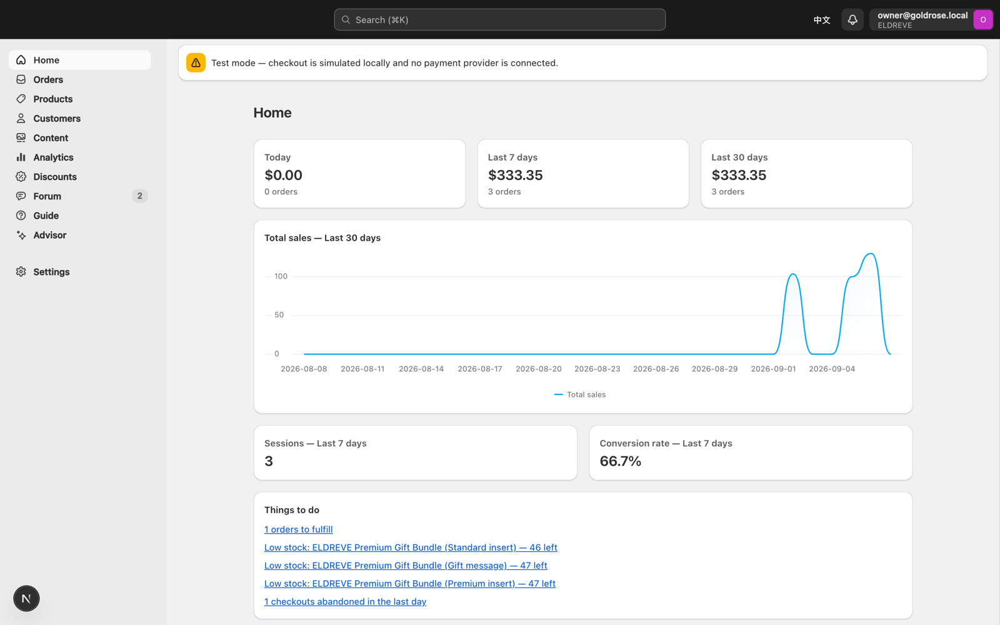
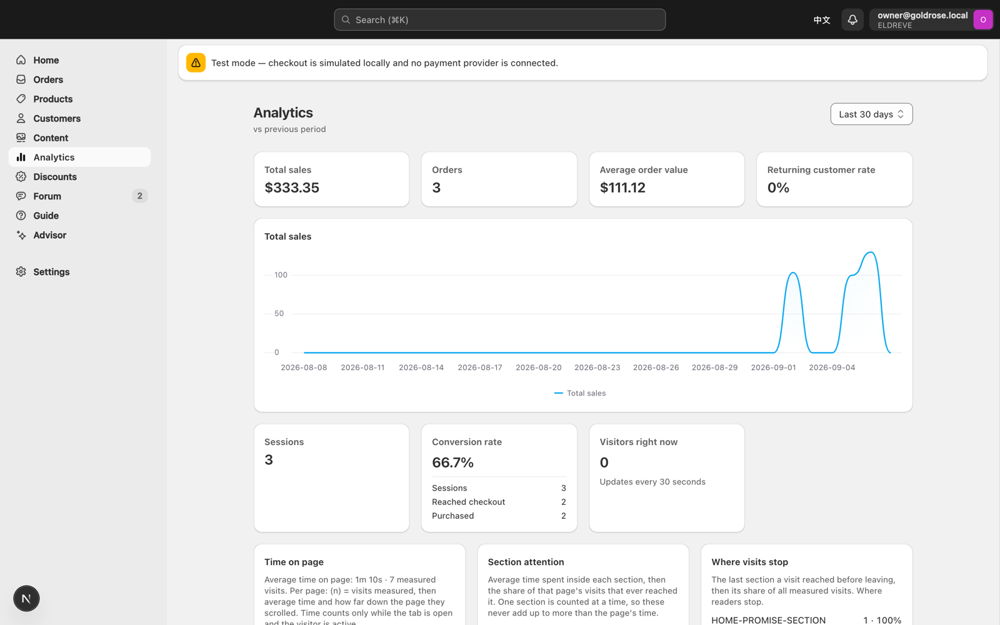

# ELDREVE

Direct-to-consumer storefront for a 24K gold-dipped rose gift line, with its own commerce admin and native checkout — no Shopify.

[](https://github.com/CharlesChi715/goldrose-storefront/actions/workflows/ci.yml)

Live at **[eldreve.com](https://eldreve.com)**. Designed, built and shipped by one engineer for Zhongshu Technology Worldwide Ltd (Hong Kong): 80 routes, 21 database tables and 401 automated tests across 76,331 lines of TypeScript. It replaced the brand's Shopify storefront, so everything a merchant needs — catalogue, checkout, orders, inventory, customers, discounts, analytics — is implemented here rather than rented.

<table>
  <tr>
    <td width="30%"></td>
    <td width="70%"></td>
  </tr>
  <tr>
    <td align="center"><em>Storefront, rendered from the Figma design</em></td>
    <td align="center"><em>Admin — orders, inventory, customers, content, analytics</em></td>
  </tr>
</table>

## What's inside

**Storefront** — 48 pages: catalogue with faceted search, product detail with reviews and per-image spotlight zoom, cart, native PayPal checkout, customer accounts (magic-link and OAuth sign-in), order history, gift reminders and a business-enquiry flow. Structured data, a database-driven sitemap and an `/llms.txt` endpoint make the catalogue legible to search engines and to AI crawlers.

**Admin** — 32 pages modelled on Shopify's operator idiom with [Polaris](https://polaris.shopify.com/): orders (including drafts, abandoned checkouts and packing slips), an inventory screen with reason-coded stock adjustments, customers, discounts, file management, CSV exports, a settings area with a team allowlist, and a homepage editor that makes 175 fields owner-editable. The interface is bilingual, English and Simplified Chinese.

**Analytics** — first-party page-view and engagement measurement rather than a third-party tag: a beacon endpoint feeds a state machine that counts time only while the tab is visible and the visitor is active, and lets exactly one section own the clock at a time, so per-section dwell can never exceed the page total.



## Design decisions

The choices worth explaining, and what each one bought:

- **Two interchangeable database backends behind one 15-method interface.** Hosted Supabase Postgres in production; a single JSON file in local mode. `git clone && npm install && npm run seed && npm run dev` gives you a working shop and admin with no cloud account, no credentials and no Docker — and the test suite runs in that mode, so it can never touch live data.
- **The server re-prices every cart from the database.** The browser stores only variant IDs and quantities. Mock checkout, PayPal order creation and PayPal capture each recompute the total from database rows, so tampered client state cannot change what a buyer pays.
- **The storefront reads through a SQL view with the public key.** `catalog_products` exposes what a shopper may see; cost and stock columns are not in the view, so a leaked anon key still cannot read margins or inventory.
- **The admin answers 404, not 401.** `requireAdmin()` runs in the layout and again at the top of every action and route, and a partial Supabase configuration fails closed to a locked admin rather than falling open.
- **Money is integer cents, everywhere.** No floating point crosses a boundary.
- **Design fidelity by construction.** The storefront is a fixed 430 px design canvas positioned at Figma-verbatim coordinates and scaled to the viewport, with sub-pixel correction because browsers round fractional offsets. Three masked Playwright baselines hold the result to the design.
- **CI guards written after real incidents, not in advance.** Two branches once added a migration numbered `0009`; git merged both cleanly and every check passed because nothing read a `.sql` file. `npm run check:migrations` now blocks that. `npm run check:assets` catches icon PNGs that are fully opaque — the signature of a glyph cropped out of a flat render, which had already shipped two visibly wrong star ratings.
- **Every source file opens with a "role of this file" header,** and non-obvious decisions carry a dated rationale naming the incident that caused them.

## Architecture

One Next.js App Router application, server components by default, deployed to Vercel from `main`.

```text
                    ┌───────────────────────────────────────────────┐
  browser  ───────► │  Next.js 16, App Router, React 19             │
                    │                                               │
                    │  app/         80 pages, 20 route handlers     │
                    │  components/  storefront screens (Figma)      │
                    │  lib/         domain logic, zod at every edge │
                    └───────────┬───────────────────────┬───────────┘
                                │                       │
                     TableStore interface         PayPal Orders v2
                     (15 methods, one shape)      server-side only
                                │                       │
              ┌─────────────────┴─────┐                 ▼
              ▼                       ▼           create, capture
    Supabase Postgres          .data/db.json      webhook signature
    21 tables, 13 migrations   one JSON file      verified upstream
    RLS on every table         (local + CI)
```

`lib/supabase/store.ts` picks the backend at runtime from which environment variables are present. Row types are snake_case to match PostgREST exactly, so the two implementations are interchangeable row for row, and everything richer than get/where/insert/update/delete is written once in TypeScript above them. The hosted adapter pages past PostgREST's 1000-row cap rather than silently truncating.

Admin authentication is Supabase Auth plus membership in an `admin_users` allowlist, enforced in [`proxy.ts`](proxy.ts) and again in every action. Customer accounts link to an order history only when the identity provider actually verified the email address. Uploads resolve through one `fileUrl()` helper — Supabase Storage when hosted, a traversal-guarded local route otherwise.

## Tech stack

| Layer | Choice |
| --- | --- |
| Framework | Next.js 16 (App Router), React 19, TypeScript (strict) |
| Styling | Tailwind CSS 4 |
| Admin UI | Shopify Polaris 13 and Polaris Viz |
| Data | Supabase Postgres, or a local JSON file adapter |
| Auth | Supabase Auth (OAuth, magic link); HMAC cookie in local mode |
| Payments | PayPal Orders v2, server-side, with signature-verified webhooks |
| Validation | Zod at every trust boundary |
| Email | Resend, with console fallback |
| AI | Anthropic SDK — a scoped admin assistant, key held per admin |
| Testing | `node --test`, Playwright |
| Hosting | Vercel |

## Quick start

Node 22 and npm. No accounts, keys or containers are needed — the app falls back to a local file database.

```bash
git clone https://github.com/CharlesChi715/goldrose-storefront.git
cd goldrose-storefront
npm install
npm run seed -- --reset          # writes .data/db.json, the local database
ALLOW_LOCAL_MODE=1 npm run dev   # http://localhost:3000, admin at /admin
```

Locally the admin opens without a password and checkout is simulated, so no money moves. Every environment variable is optional and documented in [`.env.example`](.env.example), which also maps which credential belongs to which side of the browser / server / database boundary.

> [!NOTE]
> `npm run dev` deliberately refuses to start against the local file database unless you ask for it by name with `ALLOW_LOCAL_MODE=1`. With Supabase credentials present it connects to the hosted database, and a dev server quietly backed by seed data looks real when it is not.

## Tests and CI

```bash
npm run test:unit    # 221 tests, node --test, no services, ~0.6s
npx playwright install
npm run test:e2e     # 180 tests against a production build on port 3001
```

The Playwright configuration blanks the Supabase, PayPal and Resend variables for its own server, so the suite cannot reach hosted data, real money or the live email quota. Unit tests cover the logic that is genuinely easy to get wrong: webhook idempotency, price derivation, discount and facet matching, engagement dwell rules, reminder time zones and the migration checker itself.

[CI](.github/workflows/ci.yml) runs nine gates on every push and pull request — `lint`, `typecheck`, `format:check`, `check:assets`, `check:migrations`, `features:check`, `test:unit`, a seed and a full production build. The end-to-end suite runs locally rather than in CI: its pixel baselines are macOS-rendered and would fail on a Linux runner.

## Repository layout

```text
app/            routes — 48 storefront pages, 32 admin pages, 20 handlers
components/     storefront screens imported from the design
lib/            domain logic: catalog, checkout, paypal, admin, account, supabase
supabase/       13 SQL migrations — 21 tables, views, indexes
scripts/        seed, environment and migration guards, Figma sync, feature CLI
tests/          unit tests and Playwright specs with visual baselines
docs/           specs, feature records, database reference, learning series
```

## Documentation

| Document | What it covers |
| --- | --- |
| [`SUMMARY.md`](SUMMARY.md) | Repository entrypoint: goal, current state, safety rules |
| [`docs/admin-design.md`](docs/admin-design.md) | The authoritative admin specification |
| [`docs/Database.md`](docs/Database.md) | Schema reference and data rules |
| [`docs/features/README.md`](docs/features/README.md) | 21 feature records; the roadmap table is generated from their front matter and validated in CI |
| [`docs/learning/`](docs/learning/) | Ten end-to-end walkthroughs, each tracing one flow from click to database |
| [`.env.example`](.env.example) | Every variable, and which trust boundary it belongs to |

## Status and limitations

The site is live, and the following are deliberately incomplete:

- **Payments run in PayPal sandbox.** The integration is end-to-end and has taken a sandbox payment; switching to live is an owner-only release gate. There is no card rail — the credit-card option is a form, not a processor.
- **Seven `/policies/*` pages and the blog are coming-soon scaffolds,** and `/orders/track` shows the design's placeholder timeline. Real order status exists for signed-in customers at `/account/orders`.
- **The storefront is a scaled fixed-width mobile canvas,** not a fluid responsive layout with breakpoints.
- **The admin assistant is a scoped assistant, not an agent.** It streams answers from a small hand-maintained allowlist document, with each admin supplying their own Anthropic key, stored in Supabase Vault behind restricted-grant functions. No retrieval, no tools, no database access.
- **The admin is about 95% translated** into Simplified Chinese, falling back to English per key. The storefront is English only.
- **The repository name predates the brand.** `goldrose-storefront` was the working name before the rename to ELDREVE.

## Licence and contact

© 2026 Zhongshu Technology Worldwide Ltd. All rights reserved. This repository is published for portfolio review; no licence is granted to use, copy, modify or deploy it.

Built by Yaofu (Charles) Qi — [github.com/CharlesChi715](https://github.com/CharlesChi715) · [linkedin.com/in/charles-qi](https://www.linkedin.com/in/charles-qi)
