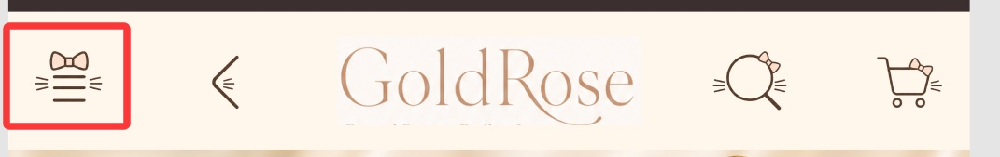
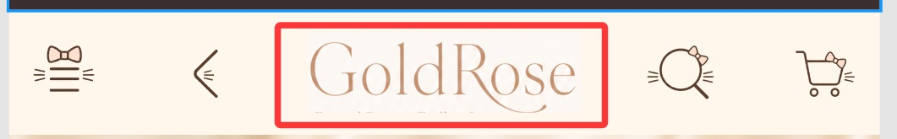
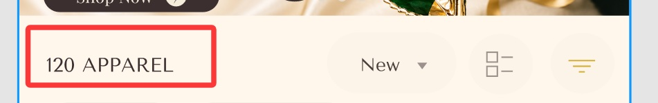
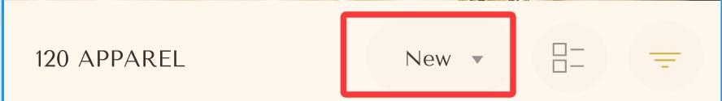
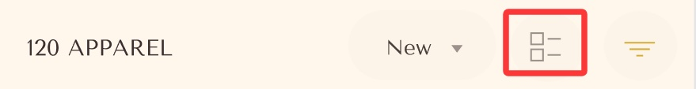
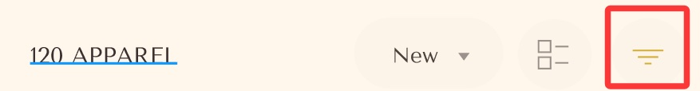
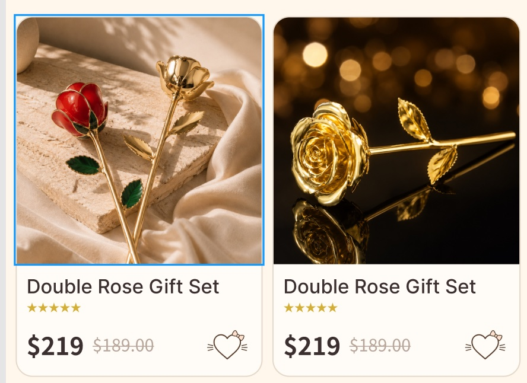

# Shop 页交互规格（N-01…N-15）

来源：设计团队《主页_shop页机制.numbers》·「shop页机制」表，文字逐字保留。截图为设计团队标注的 Figma 原型，红框 = 该行所指元素。引用方式见 [README](README.md)。

## 索引

| 编号 | 区域/模块        | 元素类型       | 目标页制作情况 |
| ---- | ---------------- | -------------- | -------------- |
| N-01 | 顶部促销条       | 公告条         | —              |
| N-02 | 顶部导航栏       | 菜单图标按钮   | 未做           |
| N-03 | 顶部导航栏       | 返回图标按钮   | —              |
| N-04 | 顶部导航栏       | Logo 文字链接  | —              |
| N-05 | 顶部导航栏       | 搜索图标按钮   | 未做           |
| N-06 | 顶部导航栏       | 购物车图标按钮 | —              |
| N-07 | 主推横幅         | CTA链接        | —              |
| N-08 | 列表页工具条     | 结果数量文字   | —              |
| N-09 | 列表页工具条     | 排序下拉菜单   | —              |
| N-10 | 列表页工具条     | 视图切换按钮   | 目前先不做     |
| N-11 | 列表页工具条     | 筛选按钮       | —              |
| N-12 | 列表页已选筛选区 | 筛选标签 Chip  | —              |
| N-13 | 商品网格         | 商品卡         | —              |
| N-14 | 分页             | 分页器         | —              |
| N-15 | AI agent         | 客服入口       | 未做           |

## 顶部促销条

### N-01 · 公告条

| 字段            | 内容                                   |
| --------------- | -------------------------------------- |
| 布局属性        | 页面顶部；吸顶固定                     |
| 是否可点击/操作 | 默认不可点击                           |
| 触发方式        | 无                                     |
| 跳转/触发结果   | 仅展示品牌主张                         |
| 目标页面/界面   | 无                                     |
| 状态与反馈      | 文本可配置，不滚动                     |
| 开发备注        | 画面未见目标链接；不应擅自整条可点击。 |
| 目标页制作情况  | —                                      |

## 顶部导航栏

### N-02 · 菜单图标按钮

| 字段            | 内容                                              |
| --------------- | ------------------------------------------------- |
| 布局属性        | 顶部吸顶固定；居左                                |
| 是否可点击/操作 | 可点击                                            |
| 触发方式        | 单击                                              |
| 跳转/触发结果   | 打开侧边导航抽屉                                  |
| 目标页面/界面   | 侧边菜单栏（抽屉）                                |
| 状态与反馈      | 打开后显示遮罩；再次点击/点遮罩关闭；页面滚动锁定 |
| 开发备注        | 菜单内容含分类、账户、客服等入口                  |
| 目标页制作情况  | 未做                                              |

### N-03 · 返回图标按钮

| 字段            | 内容                             |
| --------------- | -------------------------------- |
| 布局属性        | 顶部吸顶固定；菜单右侧           |
| 是否可点击/操作 | 可点击                           |
| 触发方式        | 单击                             |
| 跳转/触发结果   | 返回上一页                       |
| 目标页面/界面   | 浏览器上一页；无历史时回首页     |
| 状态与反馈      | 点击有按压态；无历史时静默跳首页 |
| 开发备注        | 详情页/内页建议显示；首页隐藏    |
| 目标页制作情况  | —                                |

### N-04 · Logo 文字链接

| 字段            | 内容                                     |
| --------------- | ---------------------------------------- |
| 布局属性        | 顶部吸顶固定；水平居中                   |
| 是否可点击/操作 | 可点击                                   |
| 触发方式        | 单击                                     |
| 跳转/触发结果   | 跳转网站首页                             |
| 目标页面/界面   | 首页                                     |
| 状态与反馈      | 点击有轻微按压/透明度反馈                |
| 开发备注        | 当前已在首页时，点击滚回顶部，不重复刷新 |
| 目标页制作情况  | —                                        |

### N-05 · 搜索图标按钮

| 字段            | 内容                                 |
| --------------- | ------------------------------------ |
| 布局属性        | 顶部吸顶固定；Logo 右侧              |
| 是否可点击/操作 | 可点击                               |
| 触发方式        | 单击                                 |
| 跳转/触发结果   | 展开搜索框/搜索层                    |
| 目标页面/界面   | 顶部搜索框或全屏搜索层               |
| 状态与反馈      | 展开后自动聚焦输入框；支持清空与关闭 |
| 开发备注        | 输入关键词回车后跳搜索结果页         |
| 目标页制作情况  | 未做                                 |

### N-06 · 购物车图标按钮

| 字段            | 内容                           |
| --------------- | ------------------------------ |
| 布局属性        | 顶部吸顶固定；最右侧           |
| 是否可点击/操作 | 可点击                         |
| 触发方式        | 单击                           |
| 跳转/触发结果   | 打开购物车抽屉                 |
| 目标页面/界面   | 购物车侧边抽屉；全屏购物车界面 |
| 状态与反馈      | —                              |
| 开发备注        | —                              |
| 目标页制作情况  | —                              |

## 主推横幅

### N-07 · CTA链接

| 字段            | 内容                              |
| --------------- | --------------------------------- |
| 布局属性        | 内容流内                          |
| 是否可点击/操作 | 是                                |
| 触发方式        | 单击                              |
| 跳转/触发结果   | 站内路由跳转                      |
| 目标页面/界面   | 相对应的商品详情页                |
| 状态与反馈      | 悬停/按下；目标不可用时降级集合页 |
| 开发备注        | —                                 |
| 目标页制作情况  | —                                 |

## 列表页工具条

### N-08 · 结果数量文字

| 字段            | 内容                                             |
| --------------- | ------------------------------------------------ |
| 布局属性        | 工具条居左；随列表吸顶                           |
| 是否可点击/操作 | 不可点击                                         |
| 触发方式        | —                                                |
| 跳转/触发结果   | 无跳转，仅展示                                   |
| 目标页面/界面   | —                                                |
| 状态与反馈      | 数字随筛选/分类结果实时刷新                      |
| 开发备注        | 纯统计文案；数量由当前结果集动态计算，勿写死 120 |
| 目标页制作情况  | —                                                |

### N-09 · 排序下拉菜单

| 字段            | 内容                                                     |
| --------------- | -------------------------------------------------------- |
| 布局属性        | 工具条居右；数量右侧                                     |
| 是否可点击/操作 | 可点击                                                   |
| 触发方式        | 单击展开                                                 |
| 跳转/触发结果   | 打开排序选项下拉                                         |
| 目标页面/界面   | 排序下拉面板（New/价格区间/热销等）                      |
| 状态与反馈      | 展开显示选项；选中项高亮并回填按钮文字；不跳页只刷新列表 |
| 开发备注        | 排序改变走 URL 参数，便于分享/刷新保持状态               |
| 目标页制作情况  | —                                                        |

### N-10 · 视图切换按钮

| 字段            | 内容                                 |
| --------------- | ------------------------------------ |
| 布局属性        | 工具条居右                           |
| 是否可点击/操作 | 可点击                               |
| 触发方式        | 单击                                 |
| 跳转/触发结果   | 切换列表排布（单列/双列网格）        |
| 目标页面/界面   | 当前列表页，仅改变布局               |
| 状态与反馈      | 当前视图图标高亮；切换后记住用户偏好 |
| 开发备注        | 不跳页；建议本地保存所选视图         |
| 目标页制作情况  | 目前先不做                           |

### N-11 · 筛选按钮

| 字段            | 内容                                      |
| --------------- | ----------------------------------------- |
| 布局属性        | 工具条最右                                |
| 是否可点击/操作 | 可点击                                    |
| 触发方式        | 单击                                      |
| 跳转/触发结果   | 打开筛选抽屉/面板                         |
| 目标页面/界面   | 筛选面板（颜色、场景等）                  |
| 状态与反馈      | 打开有遮罩；有已选条件时图标显示角标/高亮 |
| 开发备注        | 筛选结果实时刷新 N-08数量；提供重置与应用 |
| 目标页制作情况  | —                                         |

## 列表页已选筛选区

### N-12 · 筛选标签 Chip

| 字段            | 内容                                                           |
| --------------- | -------------------------------------------------------------- |
| 布局属性        | 工具条下方横排                                                 |
| 是否可点击/操作 | 可点击                                                         |
| 触发方式        | 单击 × 或整颗标签                                              |
| 跳转/触发结果   | 移除该筛选条件并刷新列表                                       |
| 目标页面/界面   | 当前商品列表页                                                 |
| 状态与反馈      | 点击后标签消失；数量文案同步更新；列表重载                     |
| 开发备注        | 同类标签统一规则；一行最多四个标签，第五个之后在下一行左边开始 |
| 目标页制作情况  | —                                                              |

## 商品网格

### N-13 · 商品卡

| 字段            | 内容                                                                                                                                                                  |
| --------------- | --------------------------------------------------------------------------------------------------------------------------------------------------------------------- |
| 布局属性        | 双列内容流                                                                                                                                                            |
| 是否可点击/操作 | 是                                                                                                                                                                    |
| 触发方式        | 点击卡片/图片/标题                                                                                                                                                    |
| 跳转/触发结果   | 站内路由跳转                                                                                                                                                          |
| 目标页面/界面   | 对应商品详情页                                                                                                                                                        |
| 状态与反馈      | 悬停/按下、图片加载、价格促销、售罄态                                                                                                                                 |
| 开发备注        | 重复商品卡合并规则；不同卡使用各自商品ID/slug。重复商品卡合并写规则。同一商品ID/slug 在不同筛选结果中重复出现时，统一跳转同一商品详情页，不因筛选来源拆成多个详情页。 |
| 目标页制作情况  | —                                                                                                                                                                     |

## 分页

### N-14 · 分页器

| 字段            | 内容                                     |
| --------------- | ---------------------------------------- |
| 布局属性        | 内容流底部                               |
| 是否可点击/操作 | 是                                       |
| 触发方式        | 点击页码                                 |
| 跳转/触发结果   | 更新列表并滚动到列表顶部                 |
| 目标页面/界面   | 当前集合下一页                           |
| 状态与反馈      | 当前页、禁用、加载、无更多、历史返回复位 |
| 开发备注        | 需保留筛选参数与滚动恢复。               |
| 目标页制作情况  | —                                        |

## AI agent

### N-15 · 客服入口

| 字段            | 内容                                |
| --------------- | ----------------------------------- |
| 布局属性        | 页尾内容流；固定栏                  |
| 是否可点击/操作 | 是                                  |
| 触发方式        | 点击                                |
| 跳转/触发结果   | 打开客服聊天弹窗/抽屉               |
| 目标页面/界面   | Gifting Concierge 聊天界面          |
| 状态与反馈      | 连接中、在线/离线、发送失败、转人工 |
| 开发备注        | 与商品详情客服规则共用。            |
| 目标页制作情况  | 未做                                |

