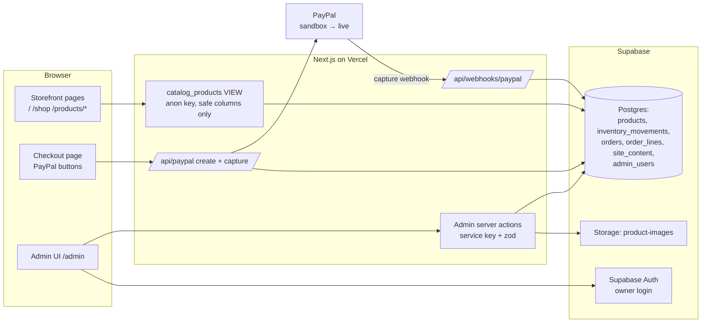
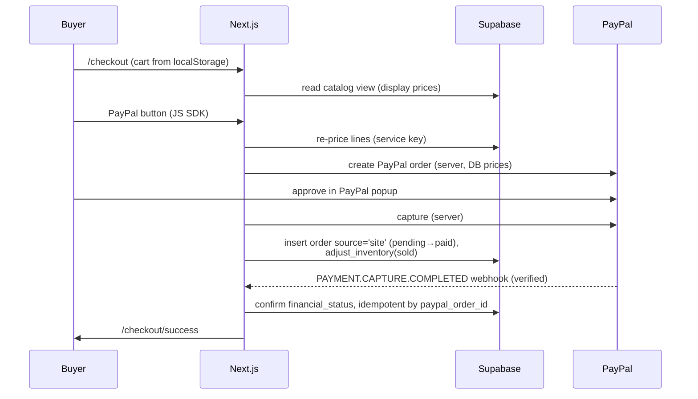

# GoldRose Admin — Full Design Document

_Design for the custom admin backend + native checkout that replace Shopify.
Written 2026-07-21 · Rev 2 (same day): **single-phase build — the Shopify
transition rail ("Phase A") was cut** because the store has no customers yet
(still testing), so there is no live money flow to protect. Status: approved
design, not yet built._

---

## 1. Purpose & vision

Build "our own Shopify" for GoldRose in **one phase**:

- an `/admin` area where the owner manages **products, prices, inventory,
  orders, and site content** without touching code, backed by the project's
  first real database (Supabase), and
- a **native checkout that takes payments directly through PayPal**
  (Orders API v2 — the owner has the verified PayPal business account, already
  proven with a real payment on 2026-07-15).

Shopify is removed as part of this build, not after it. Development and
testing run against **PayPal sandbox**; live keys are swapped in at launch.

Guiding constraints:

| Constraint | Consequence |
|---|---|
| Owner is non-technical | Admin UI uses plain language (EN / 中文), archives instead of deletes, can't lock itself out |
| No customers yet — still testing | Breaking the temporary Shopify checkout is acceptable; no transition rail, no data-compat baggage |
| Local dev must work without payment keys | Mock checkout mode stays: full click-through with no money moving |
| Storefront pages are pixel-exact Figma imports | Admin-driven data slots into existing text boxes; layouts don't change |
| We never store card data | Payment details live with PayPal only, in every phase of the business |

---

## 2. Where data lives

| Data | Today | After this build |
|---|---|---|
| Products & prices | Hardcoded `lib/products.ts` | **Supabase** |
| Inventory | Hand-edited numbers in the same file | **Supabase** (+ movement log) |
| Orders | Shopify admin (1 test order) / ephemeral JSON for mocks | **Supabase** (source: mock or site) |
| Site copy (promo slogan …) | Baked into page code / PNG crops | **Supabase** `site_content` |
| Customer payment details | Shopify + PayPal | **PayPal only** |
| Cart | Buyer's browser localStorage | unchanged |

---

## 3. Architecture overview



Key rules:

- The storefront reads **only** a SQL view (`catalog_products`) that
  physically excludes private columns (landed cost, stock counts). Even if
  the public anon key leaked, nothing sensitive is readable.
- All writes go through **admin server actions** (validated with zod) or the
  payment routes (`/api/paypal/*`, `/api/webhooks/paypal`) using the
  service-role key, which exists only in server-side code (`server-only`
  import guard).
- The admin lives at `app/admin/*` with its own plain Tailwind layout — a
  normal responsive web app, deliberately **not** the pixel-canvas chrome.

---

## 4. Data model

Migration file: `supabase/migrations/0001_init.sql`.

### 4.1 `products`

| Column | Type | Notes |
|---|---|---|
| `id` | text **PK** | Slug-style (`"signature-gold-rose"`), matches cart line ids |
| `sku` | text unique | Warehouse code (`GR-SIG-001`) |
| `handle` | text unique | URL slug → `/products/[handle]`. Admin warns: don't change after launch |
| `name` / `short_name` | text | Full name / card display name |
| `price_cents` | int ≥ 0 | Selling price — **the only price that exists**. All money is integer cents |
| `compare_at_price_cents` | int null | "Was" price, struck through |
| `landed_cost_cents` | int | **PRIVATE** — unit cost to the business; never in the storefront view |
| `inventory_on_hand` | int | **PRIVATE** — mutated only via `adjust_inventory()` |
| `reorder_point` | int | Low-stock badge threshold |
| `package_weight_oz` | numeric | For shipping calc at launch |
| `image_path` / `image_alt` | text | Storage public URL + alt text |
| `description`, `best_for`, `badge` | text | Copy fields |
| `options`, `details`, `tags` | text[] | Flat string lists (no per-option pricing — deliberate non-modeling) |
| `status` | active / draft / archived | **No hard delete.** Archive hides from storefront, keeps history |
| `position` | int | Owner-controlled ordering; drives card order on /shop |
| `created_at`, `updated_at` | timestamptz | |

_No Shopify columns — GIDs, drift-guard fields, and the price-mismatch
machinery from Rev 1 are gone with the transition rail._

### 4.2 `inventory_movements` — append-only stock log

`id, product_id FK, delta int, reason ∈ (received, sold, adjustment,
correction), note, created_by, created_at`.

Stock is never edited directly. A Postgres function keeps count + log atomic:

```sql
create function adjust_inventory(p_product_id text, p_delta int, p_reason text, p_note text default null)
returns void language plpgsql security definer as $$
begin
  update products set inventory_on_hand = inventory_on_hand + p_delta, updated_at = now()
    where id = p_product_id;
  insert into inventory_movements (product_id, delta, reason, note)
    values (p_product_id, p_delta, p_reason, p_note);
end $$;
```

**Decision (Charles):** sales auto-decrement stock — every completed order
(mock or real) writes a visible `sold` movement the owner can correct by hand.

### 4.3 `orders` + `order_lines`

| Column | Notes |
|---|---|
| `id` uuid PK, `number` text | Human order number (e.g. `GR-1042`) |
| `source` ∈ **mock / site** | mock = dev/demo checkout; site = real PayPal order |
| `paypal_order_id` text **unique null** | Idempotency — capture webhook redeliveries upsert, never duplicate |
| `paypal_capture_id` text | Capture reference for refunds |
| `email`, `method`, `method_label` | |
| `subtotal_cents`, `shipping_cents`, `shipping_free`, `tax_cents`, `total_cents`, `currency` | |
| `financial_status` | pending / paid / refunded (from PayPal events) |
| `fulfillment_status` ∈ unfulfilled / fulfilled / cancelled | **Manual toggle** in admin |
| `placed_at`, `raw` jsonb | Raw provider payload kept for audit |

`order_lines`: `order_id FK, product_id FK (null on delete), sku, name,
option, quantity, unit_amount_cents, line_total_cents`.

### 4.4 `site_content` — editable copy slots

`key text PK` (e.g. `promo.slogan`), `value jsonb`, `default_value jsonb`,
`label`, `help`, `updated_at`.

`default_value` enables two behaviors: a one-click **"Reset to original"**,
and the pixel-perfection rule — *while value == default, the storefront keeps
serving the original Figma PNG crop; once edited, it renders real text* (§9).

### 4.5 `admin_users`

`user_id uuid PK → auth.users`. An allowlist: having a Supabase login is not
enough; the uid must also be in this table. Owner-only at launch; adding staff
later = one insert.

### 4.6 Security (RLS)

- RLS enabled on **every** table, deny-by-default, **no anon policies on base
  tables**.
- `catalog_products` view (active products, safe columns only) + `site_content`
  are the only anon-readable objects.
- Admin/server code uses the service-role key and bypasses RLS — acceptable
  because it is confined to `server-only` modules and every entry point calls
  `requireAdmin()` (§6.1) or verifies the PayPal webhook signature (§8).

---

## 5. Storefront integration

- **Catalog reads**: pages switch from build-time import to
  `createCatalogClient()` reads of the view, with `export const revalidate =
  300`. Every admin server action calls `revalidatePath("/")`,
  `revalidatePath("/shop")`, `revalidatePath("/products/[slug]", "page")` — so
  the owner's edits appear immediately while buyers get cached pages.
- **`generateStaticParams`** for `/products/[slug]` reads handles from the DB
  inside try/catch → `[]` on failure. `dynamicParams` (default true) means new
  products render on demand — **no redeploy needed to add a product**.
- **Cart refactor**: `lib/cart/store.ts` currently imports the hardcoded
  catalog into the browser bundle. It becomes `useCart(catalog)` — the catalog
  is fetched by a server component and passed as props. The localStorage
  format (`goldrose-cart-v1`: productId/option/quantity, never prices) is
  unchanged. The Shopify cart-permalink path is **deleted**, not refactored.
- **Checkout re-pricing**: the server re-prices every line from the DB when
  creating the PayPal order — tampered client prices remain impossible.
- **Design pages** (`/shop` cards, `/products/[slug]`): currently placeholder
  design text. When Charles supplies real product info, the cards render
  `short_name` / price / compare-at inside the existing pixel text boxes
  (single line, ellipsis on overflow). Card order = active products by
  `position`. Home page keeps design text; only its structured data (JSON-LD)
  and card links read the DB.

---

## 6. The admin application

Route group `app/admin/*`, Tailwind UI, sidebar: **Products · Inventory ·
Orders · Site content · Log out**, plus an **EN / 中文 language toggle**
(§6.7). All pages `noindex`, `force-dynamic`.

### 6.1 Access control

- `middleware.ts` (matcher: `/admin/:path*`, `/api/admin/:path*` — storefront
  routes stay static, webhook route stays open) refreshes the Supabase session
  cookie (@supabase/ssr, current getAll/setAll pattern) and redirects
  logged-out visitors to `/admin/login`.
- `lib/admin/auth.ts` → `requireAdmin()`: verifies session **and**
  `admin_users` membership; called in the admin layout and at the top of every
  server action. Non-members get a 404 (the admin's existence isn't leaked).
- Login page: email + password only (owner account created in the Supabase
  dashboard — no signup flow exists to be abused).

### 6.2 Dashboard (`/admin`)

At-a-glance: order count + revenue (7/30 days), low-stock products, last
content edit, sandbox/live payment-mode indicator.

### 6.3 Products (`/admin/products`)

- **List**: photo thumbnail, name, price, status chip, stock.
- **Edit/new form** — plain-language labels:
  - "Product name" / "Short name (shown on cards)"
  - "Price customers pay" — entered in dollars, stored in cents
  - "'Was' price (shown crossed out)" — optional
  - "What one unit costs you (private — never shown to customers)"
  - "Web address name" (handle) — help text: *don't change after launch;
    links and Google results point at it*
  - "Photo" — upload to Supabase Storage `product-images` bucket
  - Description / Best for / Badge / Options / Details / Tags
- **Archive**, never delete. Draft status = build a product before it's live.
- Every save: zod-validated server action → `revalidatePath(...)`.

### 6.4 Inventory (`/admin/inventory`)

Products with stock on hand and reorder point; **"+ stock received" / "−
correction"** forms calling `rpc("adjust_inventory")`; full movement history
(who/when/why); low-stock badge when `on_hand ≤ reorder_point`.

### 6.5 Orders (`/admin/orders`)

List newest-first with source badge (`mock` / `site`) and payment status;
detail page shows lines, totals, PayPal references, raw payload; single
control: fulfillment status toggle. The old public `/orders` page becomes a
redirect here.

### 6.6 Site content (`/admin/content`)

One card per slot. V1 slot: **"Top banner slogan"** with text input, reset
button, and the note *"✦ symbols may look slightly different from the original
design once edited"* (§9). The slot system is generic — future slots (hero
banner, featured products) are new rows, not new code.

### 6.7 Bilingual admin UI — English / 中文

The **admin** (not the storefront — that stays English for the US market) is
fully bilingual, switched by a persistent **EN / 中文** button in the sidebar.

- **Mechanism**: `lib/admin/i18n.ts` — one typed dictionary with `en` and `zh`
  maps (`t("products.price.label")`); a missing `zh` key falls back to `en` so
  a half-translated build never crashes or shows blanks.
- **Persistence**: the choice is stored in an `admin_lang` cookie (not
  localStorage) so server-rendered admin pages come out in the right language
  with no flash; the toggle is a tiny server action that sets the cookie and
  refreshes.
- **Coverage**: every admin-authored string — sidebar, form labels and help
  text, buttons, warnings, zod validation messages, empty states, and
  dashboard cards. Simplified Chinese (简体).
- **Not translated**: data the owner types (product names, descriptions,
  slogans); provider statuses from raw payloads are mapped to translated
  display labels where shown.
- **Build rule**: no hardcoded UI strings in admin components — everything
  through `t()`, both languages added in the same commit as each new screen.

---

## 7. Checkout — the native PayPal flow



- `app/api/paypal/create/route.ts` — re-prices the cart from the DB, creates
  the PayPal order, returns its id to the JS SDK buttons.
- `app/api/paypal/capture/route.ts` — captures after approval, writes the
  order + lines + stock decrement, returns the success redirect.
- **Mock mode stays**: with no `PAYPAL_*` env set (local dev), `/api/checkout`
  simulates the whole flow exactly as today — order saved with source='mock',
  no money, full click-through.
- **Environments**: `PAYPAL_ENV=sandbox` for all testing (fake money, real
  flow), flipped to `live` + live keys at launch.
- Card-without-PayPal-branding (Advanced Card Processing vs adding Stripe):
  decide at launch; not part of this build. Shop Pay is gone with Shopify —
  accepted.

---

## 8. PayPal capture webhook

`app/api/webhooks/paypal/route.ts` (Node runtime):

1. Receive event; verify authenticity against PayPal's
   `verify-webhook-signature` API using `PAYPAL_WEBHOOK_ID` (server-to-server
   check — no shared-secret HMAC like Shopify's).
2. Handle `PAYMENT.CAPTURE.COMPLETED` (→ financial_status 'paid') and
   `PAYMENT.CAPTURE.REFUNDED` (→ 'refunded').
3. Idempotent upsert keyed on `paypal_order_id` — the capture route usually
   wrote the order already; the webhook confirms/repairs it (e.g. buyer closed
   the tab between approval and our capture response).
4. Respond 200 quickly.

Setup (documented in README): PayPal Developer Dashboard → app → add webhook
URL `https://<prod-domain>/api/webhooks/paypal`, subscribe to the two capture
events, copy the webhook id into `PAYPAL_WEBHOOK_ID`.

This route sits **outside** the auth middleware matcher (signature
verification is its auth).

---

## 9. Pixel-perfection vs editable content

Conflict: the promo slogan is currently served as a PNG crop of Figma's own
render (`public/veloria/glyph-promo.png`) because its ✦ glyphs hit different
fallback fonts in browsers.

Resolution — `PromoBar({ slogan, isDefault })`:

- `isDefault` (DB value equals `default_value`) → serve the PNG exactly as
  today. Pixel-diff stays perfect.
- Edited → render real text in the same 358×20 box (Inter, same size/color),
  accepting minor glyph drift. Admin shows the caveat inline.
- "Reset to original" restores the default and therefore the PNG.

The same rule generalizes to any future slot that currently ships as a pixel
crop.

---

## 10. Shopify shutdown

Happens inside this build (Stage 4), not after it:

- **Delete**: `lib/shopify/` (config, client, mock, permalink, types), the
  permalink branch in the checkout page, the `shop_pay` payment method entry,
  all `SHOPIFY_*` env vars from `.env.example` / `.env.local` / Vercel.
- **Keep**: the mock checkout engine (`lib/checkout/process.ts` card/express
  simulation) — it becomes the no-keys dev mode.
- **Owner actions**: after the first successful sandbox order end-to-end,
  cancel the Shopify trial/subscription. The single historical Shopify test
  order (2026-07-15, PayPal $1-test since reverted) needs no migration.
- **Launch prerequisites** (tracked in [launch-checklist.md](launch-checklist.md),
  not blockers for this build while testing): sales-tax approach (tax was
  Shopify's job; simplest is tax-inclusive pricing or a tax API at launch),
  shipping rates, refund workflow (PayPal dashboard), real domain, policy
  pages.

---

## 11. Environments & configuration

New env vars (added to `.env.example`, `.env.local`, Vercel; all `SHOPIFY_*`
vars removed):

```
NEXT_PUBLIC_SUPABASE_URL=        # Supabase project URL
NEXT_PUBLIC_SUPABASE_ANON_KEY=   # public key — can only read the safe view
SUPABASE_SERVICE_ROLE_KEY=       # SERVER ONLY, full DB access, marked sensitive in Vercel
PAYPAL_ENV=sandbox               # sandbox | live
PAYPAL_CLIENT_ID=                # from PayPal Developer Dashboard (matching env)
PAYPAL_SECRET=                   # SERVER ONLY
PAYPAL_WEBHOOK_ID=               # for signature verification
NEXT_PUBLIC_PAYPAL_CLIENT_ID=    # same client id, exposed for the JS SDK buttons
```

- Vercel: set for Production + Preview; Supabase vars must exist at **build
  time** (generateStaticParams queries the DB during `next build`).
- One hosted Supabase project shared by dev + prod (region ap-southeast-2 —
  near the owner; buyers hit cached Vercel pages, not the DB). Acceptable at
  this scale; revisit if staff accounts arrive.
- Owner setup checklist (README): create Supabase project → run
  `0001_init.sql` → Auth: create owner user → insert `admin_users` row →
  create public `product-images` bucket → paste keys into Vercel +
  `.env.local`; PayPal Developer Dashboard → sandbox app → client id/secret +
  webhook id.
- Hygiene: `.env.local` currently contains a stray Figma token line (unused by
  code) — delete it, and revoke that token in Figma.

---

## 12. Build stages & acceptance criteria

Each stage ships alone on `main`. (With no customers, "checkout keeps
working" means the mock flow + storefront stay green at every stage; the
Shopify permalink survives only until Stage 4 replaces it.)

| # | Stage | Key files | Accepted when |
|---|---|---|---|
| 0 | Test baseline | `playwright.config.ts`, `tests/e2e/*` | Pixel snapshots of `/`, `/shop`, product page committed; mock checkout click-through green (cart → pay → success → order recorded) |
| 1 | Supabase + seed | `supabase/migrations/0001_init.sql`, `lib/supabase/*`, `scripts/seed.ts` | Seed prints 3 products; rows visible in dashboard; site unchanged; Stage 0 green |
| 2 | Auth + shell | `middleware.ts`, `app/admin/login`, `app/admin/layout.tsx`, `lib/admin/i18n.ts` | Logged-out → redirected; owner logs in; non-admin 404s; EN/中文 toggle switches every label and persists across pages/reloads; storefront untouched |
| 3 | Products + inventory | `app/admin/products/*`, `app/admin/inventory/*`, `lib/admin/*` | Create/edit/archive works; photo upload works; stock adjust writes movement; low-stock badge shows |
| 4 | **Native checkout + Shopify removal** | `app/api/paypal/*`, `lib/checkout/process.ts`, `app/api/checkout/route.ts`, `lib/cart/store.ts`, checkout page split, `lib/orders/db.ts`; **delete `lib/shopify/*`** | Sandbox PayPal order completes end-to-end (create → approve → capture → order row + `sold` movement); mock mode still full click-through with no keys; tamper-replay re-priced from DB; admin price edit changes checkout total; pixel-diffs unchanged; no `SHOPIFY_*` reference left in code |
| 5 | Orders + PayPal webhook | `app/api/webhooks/paypal/route.ts`, `app/admin/orders/*` | Sandbox capture event → order confirmed 'paid' (replayed event → no duplicate); invalid signature → 401; refund event flips status; fulfillment toggle persists |
| 6 | Real data on design pages *(gated on product info from Charles)* | `app/shop/page.tsx`, `app/products/[slug]/page.tsx`, `app/page.tsx` (JSON-LD only) | Masked pixel-diff: only the designated text boxes changed; long names ellipsize without layout shift; new product appears without redeploy |
| 7 | Content + retire catalog | `lib/content.ts`, `app/admin/content/*`, `PromoBar` props, slim `lib/products.ts` | Default slogan → pixel-identical (PNG); edited → text renders; reset → PNG returns; no importer of the hardcoded array remains |

Final acceptance: owner walkthrough — log in (中文), add a product with
photo, receive stock, place a sandbox PayPal order and watch it arrive as
'paid' with an automatic `sold` movement, mark it fulfilled, edit the slogan,
reset it. Then: cancel Shopify.

---

## 13. Risks & mitigations

| Risk | Mitigation |
|---|---|
| Native checkout is all-new money code | Built and verified entirely in PayPal sandbox before any live key exists; server re-prices from DB; capture + webhook are both idempotent by `paypal_order_id` |
| Buyer drops off between approval and capture | Capture webhook repairs the order record independently of the browser |
| Sandbox/live key mix-ups | Single `PAYPAL_ENV` switch controls key set + SDK URL; dashboard shows the active mode (§6.2) |
| Build fails if Supabase is down (build-time DB reads) | try/catch → `[]` + dynamicParams; pages degrade to on-demand rendering |
| Private data (costs, stock) leaking to the storefront | Enforced by the SQL view + RLS, not by code convention |
| @supabase/ssr cookie API misuse silently breaks sessions | Use the current getAll/setAll pattern exactly |
| Owner locks himself out | No delete anywhere (archive/status flips); login managed in Supabase dashboard where password reset exists |
| Shared dev/prod database | Flagged; acceptable for a single owner; separate projects if staff join |
| Tax/shipping become our job (were Shopify's) | Deferred to launch checklist — testing phase runs tax 0 / flat shipping policy already in `lib/business.ts` |

---

## 14. Future (explicitly out of scope now)

- Customers table / accounts, wishlists, gift reminders — add only when a
  feature demands it (our DB stores references + experience data; PII stays
  with the payment provider).
- Card payments without PayPal branding (Advanced Card Processing vs Stripe) —
  launch decision.
- Concierge chat backend (the chatbox placeholder) — chat history table +
  provider integration.
- Reviews (likely a third-party service), analytics dashboards, multi-staff
  roles, desktop design pass.
