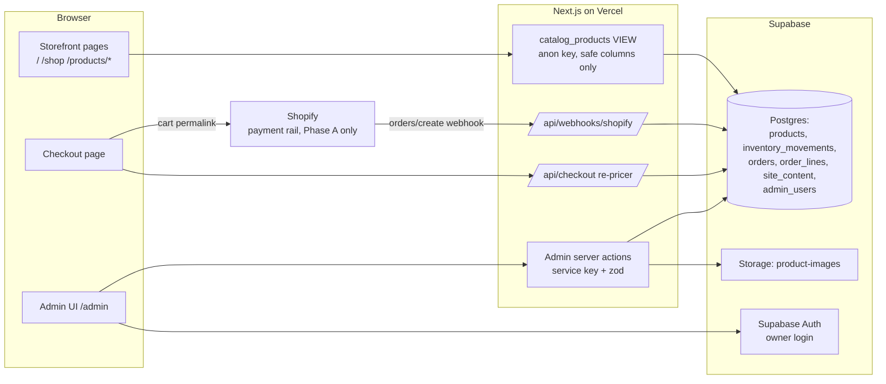
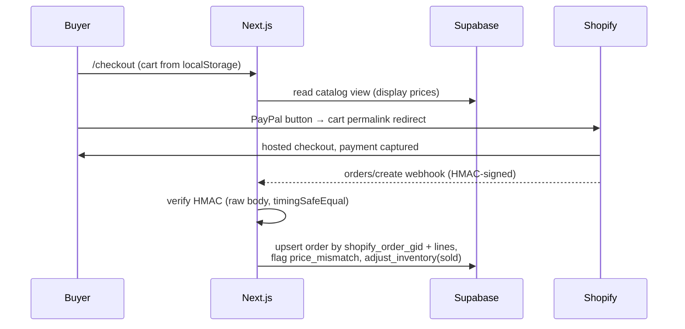
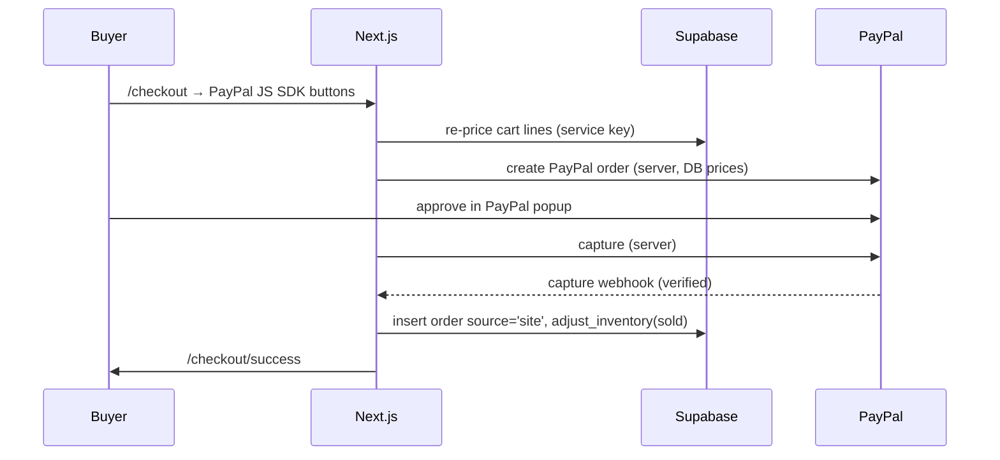

# GoldRose Admin — Full Design Document

_Design for the custom admin backend that replaces Shopify as the system of
record. Written 2026-07-21. Status: **approved design, not yet built.**_

---

## 1. Purpose & vision

Build "our own Shopify" for GoldRose: an `/admin` area where the owner manages
**products, prices, inventory, orders, and site content** without touching
code, backed by the project's first real database (Supabase).

Rollout happens in two phases:

- **Phase A (this design's build):** the admin + database become the source of
  truth for everything *except* payment processing. The buyer's checkout keeps
  handing the cart to Shopify (the proven cart-permalink flow, PayPal payment
  verified 2026-07-15) so money keeps flowing safely during the transition.
- **Phase B (designed here, built later):** our own checkout takes payments
  directly through PayPal, and the Shopify subscription is cancelled.

Guiding constraints:

| Constraint | Consequence |
|---|---|
| Owner is non-technical | Admin UI uses plain language, archives instead of deletes, can't lock itself out |
| Live checkout must never break | Each build stage ships alone; the money path changes in exactly one stage with the heaviest testing |
| Storefront pages are pixel-exact Figma imports | Admin-driven data slots into existing text boxes; layouts don't change |
| Prices shown must equal prices charged | While Shopify still charges: a visible drift warning. After Phase B: one price source, problem disappears |

---

## 2. Where data lives today (pre-build)

| Data | Today | After Phase A | After Phase B |
|---|---|---|---|
| Products & prices | Hardcoded `lib/products.ts` | **Supabase** | Supabase |
| Inventory | Hand-edited numbers in the same file | **Supabase** (+ movement log) | Supabase |
| Real orders | Shopify admin only | Shopify **+ copied into Supabase** via webhook | **Supabase only** |
| Mock/demo orders | `.data/orders.json` (wiped each deploy) | **Supabase** | Supabase |
| Site copy (promo slogan …) | Baked into page code / PNG crops | **Supabase** `site_content` | Supabase |
| Customer payment details | Shopify + PayPal | Shopify + PayPal (unchanged) | **PayPal only** — we never store card data in any phase |
| Cart | Buyer's browser localStorage | unchanged | unchanged |

---

## 3. Architecture overview



Key rules:

- The storefront reads **only** a SQL view (`catalog_products`) that
  physically excludes private columns (landed cost, stock counts). Even if
  the public anon key leaked, nothing sensitive is readable.
- All writes go through **admin server actions** (validated with zod) or the
  two server routes (`/api/checkout`, `/api/webhooks/shopify`) using the
  service-role key, which exists only in server-side code (`server-only`
  import guard).
- The admin lives at `app/admin/*` with its own plain Tailwind layout — a
  normal responsive web app, deliberately **not** the pixel-canvas chrome.

---

## 4. Data model

Migration file: `supabase/migrations/0001_init.sql`.

### 4.1 `products`

| Column | Type | Notes |
|---|---|---|
| `id` | text **PK** | Same slugs as today (`"signature-gold-rose"`) so existing browser carts keep working |
| `sku` | text unique | Warehouse code (`GR-SIG-001`) |
| `handle` | text unique | URL slug → `/products/[handle]`. Admin warns: don't change after launch |
| `name` / `short_name` | text | Full name / card display name |
| `price_cents` | int ≥ 0 | Selling price. **All money is integer cents** (avoids float bugs) |
| `compare_at_price_cents` | int null | "Was" price, struck through |
| `landed_cost_cents` | int | **PRIVATE** — unit cost to the business; never in the storefront view |
| `inventory_on_hand` | int | **PRIVATE** — mutated only via `adjust_inventory()` |
| `reorder_point` | int | Low-stock badge threshold |
| `package_weight_oz` | numeric | For future shipping calc (Phase B) |
| `image_path` / `image_alt` | text | Storage public URL + alt text |
| `description`, `best_for`, `badge` | text | Copy fields |
| `options`, `details`, `tags` | text[] | Flat string lists (no per-option pricing today — deliberate non-modeling) |
| `status` | active / draft / archived | **No hard delete.** Archive hides from storefront, keeps history |
| `position` | int | Owner-controlled ordering; drives card order on /shop |
| `shopify_product_gid`, `shopify_variant_gid` | text null | Transitional + historical. Variant GID is what the permalink checkout charges against |
| `shopify_price_cents`, `shopify_price_checked_at` | int / timestamptz | Drift guard (Phase A only; dropped in Phase B) |
| `created_at`, `updated_at` | timestamptz | |

### 4.2 `inventory_movements` — append-only stock log

`id, product_id FK, delta int, reason ∈ (received, sold, adjustment,
correction), note, created_by, created_at`.

Stock is never edited directly. A Postgres function keeps count + log atomic:

```sql
create function adjust_inventory(p_product_id text, p_delta int, p_reason text, p_note text default null)
returns void language plpgsql security definer as $$
begin
  update products set inventory_on_hand = inventory_on_hand + p_delta, updated_at = now()
    where id = p_product_id;
  insert into inventory_movements (product_id, delta, reason, note)
    values (p_product_id, p_delta, p_reason, p_note);
end $$;
```

**Decision (Charles):** sales auto-decrement stock — every mock order and
every real (webhook) order writes a visible `sold` movement the owner can
correct by hand.

### 4.3 `orders` + `order_lines`

| Column | Notes |
|---|---|
| `id` uuid PK, `number` text | Human order number |
| `source` ∈ **mock / shopify / site** | `site` = Phase B native orders |
| `shopify_order_gid` text **unique** | Webhook idempotency — redelivered webhooks upsert, never duplicate |
| `email`, `method`, `method_label` | |
| `subtotal_cents`, `shipping_cents`, `shipping_free`, `tax_cents`, `total_cents`, `currency` | |
| `financial_status` | From provider (paid/refunded/…) |
| `fulfillment_status` ∈ unfulfilled / fulfilled / cancelled | **Manual toggle** in admin |
| `price_mismatch` bool | Set when Shopify charged ≠ our price at ingest time |
| `placed_at`, `raw` jsonb | Raw provider payload kept for audit |

`order_lines`: `order_id FK, product_id FK (null on delete), sku,
shopify_variant_gid, name, option, quantity, unit_amount_cents,
line_total_cents`.

### 4.4 `site_content` — editable copy slots

`key text PK` (e.g. `promo.slogan`), `value jsonb`, `default_value jsonb`,
`label`, `help`, `updated_at`.

`default_value` enables two behaviors: a one-click **"Reset to original"**,
and the pixel-perfection rule — *while value == default, the storefront keeps
serving the original Figma PNG crop; once edited, it renders real text* (see
§9).

### 4.5 `admin_users`

`user_id uuid PK → auth.users`. An allowlist: having a Supabase login is not
enough; the uid must also be in this table. Owner-only at launch; adding staff
later = one insert.

### 4.6 Security (RLS)

- RLS enabled on **every** table, deny-by-default, **no anon policies on base
  tables**.
- `catalog_products` view (active products, safe columns only) + `site_content`
  are the only anon-readable objects.
- Admin/server code uses the service-role key and bypasses RLS — acceptable
  because it is confined to `server-only` modules and every entry point calls
  `requireAdmin()` (§6.1) or HMAC-verifies (§8).

---

## 5. Storefront integration

- **Catalog reads**: pages switch from build-time import to
  `createCatalogClient()` reads of the view, with `export const revalidate =
  300`. Every admin server action calls `revalidatePath("/")`,
  `revalidatePath("/shop")`, `revalidatePath("/products/[slug]", "page")` — so
  the owner's edits appear immediately while buyers get cached pages.
- **`generateStaticParams`** for `/products/[slug]` reads handles from the DB
  inside try/catch → `[]` on failure. `dynamicParams` (default true) means new
  products render on demand — **no redeploy needed to add a product**.
- **Cart refactor** (the one risky storefront change): `lib/cart/store.ts`
  currently imports the hardcoded catalog into the browser bundle. It becomes
  `useCart(catalog)` — the catalog is fetched by a server component and passed
  as props. Same for `buildCartPermalink(lines, catalog)`. The localStorage
  format (`goldrose-cart-v1`: productId/option/quantity, never prices) is
  untouched, so shoppers' carts survive the migration.
- **Checkout re-pricing**: `/api/checkout` already re-prices every line
  server-side; it simply re-prices from the DB instead of the array. Tampered
  client prices remain impossible.
- **Design pages** (`/shop` cards, `/products/[slug]`): currently placeholder
  design text. When Charles supplies real product info, the cards render
  `short_name` / price / compare-at inside the existing pixel text boxes
  (single line, ellipsis on overflow). Card order = active products by
  `position`. Home page keeps design text; only its structured data (JSON-LD)
  and card links read the DB.

---

## 6. The admin application

Route group `app/admin/*`, Tailwind UI, sidebar: **Products · Inventory ·
Orders · Site content · Log out**. All pages `noindex`, `force-dynamic`.

### 6.1 Access control

- `middleware.ts` (matcher: `/admin/:path*`, `/api/admin/:path*` — storefront
  routes stay static, webhook route stays open) refreshes the Supabase session
  cookie (@supabase/ssr, current getAll/setAll pattern) and redirects
  logged-out visitors to `/admin/login`.
- `lib/admin/auth.ts` → `requireAdmin()`: verifies session **and**
  `admin_users` membership; called in the admin layout and at the top of every
  server action. Non-members get a 404 (the admin's existence isn't leaked).
- Login page: email + password only (owner account created in the Supabase
  dashboard — no signup flow exists to be abused).

### 6.2 Dashboard (`/admin`)

At-a-glance: order count + revenue (7/30 days), low-stock products, any
price-drift warnings, last content edit.

### 6.3 Products (`/admin/products`)

- **List**: photo thumbnail, name, price, status chip, stock, drift badge.
- **Edit/new form** — plain-language labels:
  - "Product name" / "Short name (shown on cards)"
  - "Price customers pay" — entered in dollars, stored in cents
  - "'Was' price (shown crossed out)" — optional
  - "What one unit costs you (private — never shown to customers)"
  - "Web address name" (handle) — help text: *don't change after launch;
    links and Google results point at it*
  - "Photo" — upload to Supabase Storage `product-images` bucket
  - "Shopify variant ID" (Phase A only) — validated against
    `gid://shopify/ProductVariant/\d+`; help text: *checkout charges this
    Shopify product until we finish leaving Shopify*
  - Description / Best for / Badge / Options / Details / Tags
- **Archive**, never delete. Draft status = build a product before it's live.
- Every save: zod-validated server action → `revalidatePath(...)`.

### 6.4 Inventory (`/admin/inventory`)

Products with stock on hand and reorder point; **"+ stock received" / "−
correction"** forms calling `rpc("adjust_inventory")`; full movement history
(who/when/why); low-stock badge when `on_hand ≤ reorder_point`.

### 6.5 Orders (`/admin/orders`)

List newest-first with source badge (`mock` / `shopify` / later `site`),
payment status, red **price-mismatch** flag; detail page shows lines, totals,
raw payload; single control: fulfillment status toggle (real shipping stays in
Shopify until Phase B). The old public `/orders` page becomes a redirect here.

### 6.6 Site content (`/admin/content`)

One card per slot. V1 slot: **"Top banner slogan"** with text input, reset
button, and the note *"✦ symbols may look slightly different from the original
design once edited"* (§9). The slot system is generic — future slots (hero
banner, featured products) are new rows, not new code.

### 6.7 Price-drift guard (Phase A only)

On price save where `price_cents ≠ shopify_price_cents`: warning banner on the
product row, form, and dashboard — *"Customers are charged by Shopify. Update
this price in Shopify admin to $X, then press 'Shopify is updated'."* The
button records `shopify_price_cents = price_cents` + timestamp. Warning-only
(never blocks a save — the owner can't strand himself). Optional enhancement:
a "check against Shopify" action using the existing dormant Storefront API
client (`lib/shopify/client.ts`). Entire mechanism is deleted in Phase B.

---

## 7. Checkout & orders — Phase A flow



Mock mode (local dev, no Shopify env): `/api/checkout` re-prices from DB,
saves the order (`source='mock'`), decrements stock, returns the success URL —
same code path shape as today, DB instead of JSON file.

---

## 8. Shopify order webhook (transitional)

`app/api/webhooks/shopify/route.ts` (Node runtime):

1. `await request.text()` **before any parsing** — HMAC is computed over the
   raw body.
2. `crypto.createHmac("sha256", SHOPIFY_WEBHOOK_SECRET)`, compare with
   `timingSafeEqual` against `x-shopify-hmac-sha256`. Fail → 401.
3. Topic `orders/create`: upsert on `shopify_order_gid =
   admin_graphql_api_id` (idempotent across Shopify's redeliveries).
4. Match lines to products by variant GID; unmatched lines still stored
   (product_id null).
5. Compare Shopify's charged unit price to ours → `price_mismatch` flag.
6. `adjust_inventory(product_id, -qty, 'sold')` per matched line.
7. Respond 200 quickly (<5s or Shopify retries).

Setup (owner, documented in README): Shopify admin → Settings → Notifications
→ Webhooks → Create → "Order creation", JSON, prod URL; copy the signing
secret into Vercel env `SHOPIFY_WEBHOOK_SECRET`.

This route sits **outside** the auth middleware matcher (HMAC is its auth).

---

## 9. Pixel-perfection vs editable content

Conflict: the promo slogan is currently served as a PNG crop of Figma's own
render (`public/veloria/glyph-promo.png`) because its ✦ glyphs hit different
fallback fonts in browsers.

Resolution — `PromoBar({ slogan, isDefault })`:

- `isDefault` (DB value equals `default_value`) → serve the PNG exactly as
  today. Pixel-diff stays perfect.
- Edited → render real text in the same 358×20 box (Inter, same size/color),
  accepting minor glyph drift. Admin shows the caveat inline.
- "Reset to original" restores the default and therefore the PNG.

The same rule generalizes to any future slot that currently ships as a pixel
crop.

---

## 10. Phase B — leaving Shopify (build after Phase A)

**Payments: PayPal Orders API v2** (owner already has the verified business
account; a real payment has already been taken through PayPal).



- New: `app/api/paypal/*` (create/capture), `app/api/webhooks/paypal`
  (signature verification via PayPal's verify endpoint), env vars
  `PAYPAL_CLIENT_ID` / `PAYPAL_SECRET` / `PAYPAL_WEBHOOK_ID`.
- Card payments without PayPal branding: PayPal Advanced Card Processing or
  add Stripe — decide at Phase B kickoff. **Shop Pay is lost by definition**
  (Shopify-only) — accepted; this reverses the original Shopify-because-of-
  Shop-Pay decision.
- Delete: `lib/shopify/*`, the permalink branch in the checkout client, all
  `SHOPIFY_*` env vars, the drift-guard columns/UI, the Shopify webhook route.
  Historical `source='shopify'` orders remain.
- **Prerequisites before flipping**: sales-tax approach (today Shopify
  computes tax; it becomes our problem — likely a flat include-tax price or a
  tax API), shipping rates decision, refund workflow (PayPal dashboard), real
  domain, and updated policy pages.

---

## 11. Environments & configuration

New env vars (added to `.env.example`, `.env.local`, Vercel):

```
NEXT_PUBLIC_SUPABASE_URL=        # Supabase project URL
NEXT_PUBLIC_SUPABASE_ANON_KEY=   # public key — can only read the safe view
SUPABASE_SERVICE_ROLE_KEY=       # SERVER ONLY, full DB access, marked sensitive in Vercel
SHOPIFY_WEBHOOK_SECRET=          # Phase A only
```

- Vercel: all four set for Production + Preview; must exist at **build time**
  (generateStaticParams queries the DB during `next build`).
- One hosted Supabase project shared by dev + prod (region ap-southeast-2 —
  near the owner; buyers hit cached Vercel pages, not the DB). Acceptable at
  this scale; revisit if staff accounts arrive.
- Owner setup checklist (README): create Supabase project → run
  `0001_init.sql` → Auth: create owner user → insert `admin_users` row →
  create public `product-images` bucket → paste 3 keys into Vercel + `.env.local`.
- Hygiene: `.env.local` currently contains a stray Figma token line (unused by
  code) — delete it, and revoke that token in Figma.

---

## 12. Build stages & acceptance criteria

Each stage ships alone on `main`; live checkout works after every one.

| # | Stage | Key files | Accepted when |
|---|---|---|---|
| 0 | Test baseline | `playwright.config.ts`, `tests/e2e/*` | Pixel snapshots of `/`, `/shop`, product page committed; checkout click-through green (permalink URL asserted byte-for-byte; mock API flow returns an order) |
| 1 | Supabase + seed | `supabase/migrations/0001_init.sql`, `lib/supabase/*`, `scripts/seed.ts` | Seed prints 3 products; rows visible in dashboard; site unchanged; Stage 0 green |
| 2 | Auth + shell | `middleware.ts`, `app/admin/login`, `app/admin/layout.tsx` | Logged-out → redirected; owner logs in; non-admin 404s; storefront untouched |
| 3 | Products + inventory | `app/admin/products/*`, `app/admin/inventory/*`, `lib/admin/*` | Create/edit/archive works; photo upload works; stock adjust writes movement; drift banner appears & clears |
| 4 | **Money path → DB** | `lib/checkout/process.ts`, `app/api/checkout/route.ts`, `lib/cart/store.ts`, `lib/shopify/permalink.ts`, checkout page split, `lib/orders/db.ts` | Permalink URL byte-identical; tamper-replay re-priced from DB; admin price edit changes mock total; order lands in DB with stock decrement; pixel-diffs unchanged |
| 5 | Orders + webhook | `app/api/webhooks/shopify/route.ts`, `app/admin/orders/*` | Sample payload with valid HMAC → one row (twice → still one); bad HMAC → 401; Shopify test notification lands in prod; fulfillment toggle persists |
| 6 | Real data on design pages *(gated on product info from Charles)* | `app/shop/page.tsx`, `app/products/[slug]/page.tsx`, `app/page.tsx` (JSON-LD only) | Masked pixel-diff: only the designated text boxes changed; long names ellipsize without layout shift; new product appears without redeploy |
| 7 | Content + retire catalog | `lib/content.ts`, `app/admin/content/*`, `PromoBar` props, slim `lib/products.ts` | Default slogan → pixel-identical (PNG); edited → text renders; reset → PNG returns; no importer of the hardcoded array remains |

Final acceptance: owner walkthrough — log in, edit a price, see the drift
warning, receive stock, watch a mock order arrive with an automatic `sold`
movement, edit the slogan, reset it.

---

## 13. Risks & mitigations

| Risk | Mitigation |
|---|---|
| Stage 4 touches live money path | Ships alone; permalink asserted byte-for-byte; localStorage schema untouched; mock + live branches both tested |
| Build fails if Supabase is down (build-time DB reads) | try/catch → `[]` + dynamicParams; pages degrade to on-demand rendering |
| Private data (costs, stock) leaking to the storefront | Enforced by the SQL view + RLS, not by code convention |
| Webhook HMAC pitfalls | Raw body read first; timingSafeEqual; route excluded from auth middleware |
| @supabase/ssr cookie API misuse silently breaks sessions | Use the current getAll/setAll pattern exactly |
| Owner locks himself out | No delete anywhere (archive/status flips); warning-only guards; login managed in Supabase dashboard where password reset exists |
| Shared dev/prod database | Flagged; acceptable for a single owner; separate projects if staff join |

---

## 14. Future (explicitly out of scope now)

- Customers table / accounts, wishlists, gift reminders — add only when a
  feature demands it (per the data-architecture discussion: our DB stores
  references + experience data; PII stays with the payment provider).
- Concierge chat backend (the chatbox placeholder) — chat history table +
  provider integration.
- Reviews (likely a third-party service), analytics dashboards, multi-staff
  roles, desktop design pass.
