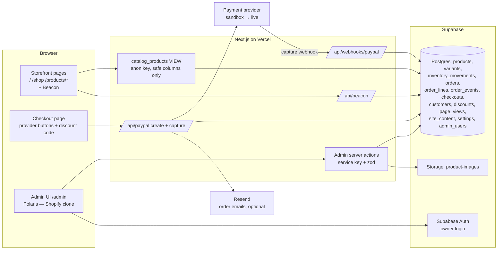
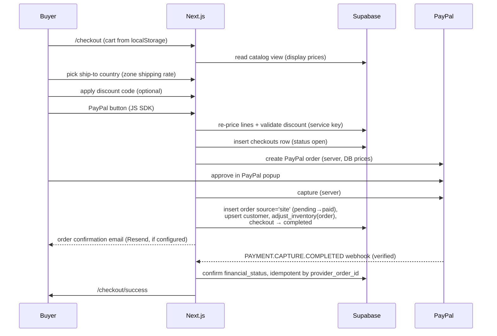

# ELDREVE Admin & Native Checkout — Design Document

|                  |                                                                                                                                                                                                                                                                                                            |
| ---------------- | ---------------------------------------------------------------------------------------------------------------------------------------------------------------------------------------------------------------------------------------------------------------------------------------------------------- |
| **Status**       | Approved for implementation. **§0 authorizes a one-shot autonomous build** — open questions resolve to working assumptions, missing resources are mocked                                                                                                                                                   |
| **Owner**        | Charles — store dev                                                                                                                                                                                                                                                                                        |
| **Users**        | Charles' teammates                                                                                                                                                                                                                                                                                         |
| **Audience**     | Implementing agents and Charles. Agents: read `SUMMARY.md` first, then §0 and §2 below                                                                                                                                                                                                                     |
| **Version**      | Rev 4.4 · 2026-07-22 — full history in §17                                                                                                                                                                                                                                                                 |
| **Related docs** | `SUMMARY.md` (repository entrypoint + current operations/release state) · `docs/seo-geo/search-discovery-implementation.md` (SEO/GEO implementation) · `docs/ideas.md`. **Historical, never implement from:** the former `docs/archive/` (deleted 2026-07-27; in git history), Shopify-era README sections |

## Table of contents

0. [One-shot autonomous build directive](#0-one-shot-autonomous-build-directive)
1. [Overview](#1-overview)
2. [How to use this document (for implementing agents)](#2-how-to-use-this-document-for-implementing-agents)
3. [Goals, constraints & non-goals](#3-goals-constraints--non-goals)
4. [Open questions](#4-open-questions)
5. [Alternatives considered](#5-alternatives-considered)
6. [Architecture](#6-architecture)
7. [Data model](#7-data-model)
8. [Storefront integration](#8-storefront-integration)
9. [The admin application — the Shopify clone](#9-the-admin-application--the-shopify-clone)
10. [Checkout & payments](#10-checkout--payments)
11. [Pixel-perfection vs editable content](#11-pixel-perfection-vs-editable-content)
12. [Shopify shutdown](#12-shopify-shutdown)
13. [Environments & configuration](#13-environments--configuration)
14. [Implementation plan](#14-implementation-plan)
15. [Risks & mitigations](#15-risks--mitigations)
16. [Future work (V2)](#16-future-work-v2)
17. [Revision history](#17-revision-history)

---

## 0. One-shot autonomous build directive

**Owner authorization (Charles, 2026-07-22):** build this entire backend in **one autonomous run** — no questions to the owner, no approval requests, no pausing for input. Make every remaining decision yourself within the guardrails below; mock anything that needs a resource only the owner can provide. The owner will be away and expects to return to a finished, verified build plus a report.

### 0.1 Decision authority

- This document is the spec. Where it is silent or ambiguous: copy the live
  Shopify admin (§1, rule 1); if that's unreachable, pick the option closest
  to Shopify's behavior and record the choice in the build report.
- The open questions (§4) do **not** block anything: build against every
  working assumption. OQ-1 → PayPal routes (sandbox code paths only);
  OQ-2 → seed zones with clearly-labeled placeholder rates; OQ-3 → the
  three existing placeholder products; OQ-4 → resource fallbacks below.
- Never wait for or ask the owner mid-build. Every "owner action" in this
  document becomes an item on the activation checklist (§0.5) instead.
- Trust hierarchy for conflicting written sources: this document >
  `SUMMARY.md` > everything else.
  The former `docs/archive/` (deleted; in git history) and the Shopify-era
  sections of `README.md` are historical — never implement from them.

### 0.2 Resource fallbacks — mock, don't ask

| Missing resource               | Fallback                                                                                                                                                                                                                                                                    |
| ------------------------------ | --------------------------------------------------------------------------------------------------------------------------------------------------------------------------------------------------------------------------------------------------------------------------- |
| Hosted Supabase project (OQ-4) | Run the full stack against **local Supabase** (`supabase start`, Docker) with the same migration + seed. If Docker is unavailable, a file/in-memory adapter behind `lib/supabase/*` so every screen and test still runs. Hosted activation = pasting env vars, nothing more |
| PayPal sandbox credentials     | Implement the real PayPal routes and webhook; verify via mock mode (§10.4) + tests with recorded fixture payloads; the live sandbox E2E moves to the activation checklist                                                                                                   |
| Resend key                     | Console-log email mode (already specced, §10.3)                                                                                                                                                                                                                             |
| Vercel production env          | `next build` must pass locally both with and without DB env vars; production env setup goes on the checklist                                                                                                                                                                |
| Shopify admin unreachable      | Build from this doc + Polaris defaults; note affected screens in the build report                                                                                                                                                                                           |

### 0.3 Guardrails (hard rules — no self-granted exceptions)

- **Sandbox/mock money only.** Never request, create, or use live payment
  credentials; never move real money.
- Owner-only actions stay owner-only: creating external accounts,
  cancelling Shopify, revoking tokens, flipping `PAYPAL_ENV=live` — checklist
  items, never performed by the agent.
- `main` is never broken: Stage 0's pixel-diff + click-through suite passes
  at every commit (owner keeps a single `main` — no branch sprawl).
- No new paid services; no dependencies beyond those this doc names
  (Polaris, polaris-viz, @supabase/*, zod, Resend SDK, Playwright).
- Secrets are never committed; `.env.example` documents every variable.

### 0.4 Execution order & definition of done

- Run stages 0 → 8 (§14.2) in order, **one commit per stage on `main`**
  (e.g. `feat(admin): stage 3 — products + variants + inventory`).
- Stage 9 (gated on OQ-3): implement the wiring with seed data so the masked
  pixel-diff still gates it; the real content swap stays with the owner.
- Each stage's "Accepted when" column is the definition of done, verified in
  mock/local mode wherever a §0.2 fallback applies — by tests where
  possible, otherwise a written verification note in the build report.
- **Done** = all stages green + `next build` passes + full e2e suite passes
  + the deliverables below exist.

### 0.5 Deliverables on completion

1. The build itself, merged to `main` stage by stage.
2. `BUILD-REPORT.md` (delivered; deleted with the archive 2026-07-27, in git history) — per stage: what shipped and how it was
   verified; every self-made decision and why; everything mocked and what
   activates it; known gaps.
3. **Owner activation checklist** (inside the report): create the Supabase
   project → run the migration + seed → paste keys into Vercel +
   `.env.local`; PayPal Developer sandbox app + webhook id; optional Resend
   key; enable MFA (§9.2); run the final walkthrough (§14.3); screenshot the
   Shopify admin (§12) **then** cancel Shopify; delete + revoke the stray
   Figma token (§13).
4. Updated `SUMMARY.md` and dated `.ai/WORKLOG.md` entries (§2).

---

## 1. Overview

Build "our own Shopify" for ELDREVE in **one phase**:

- an `/admin` area that **is the Shopify admin, as far as the owner can
  tell** — same navigation, screens, wording (in English and 中文), and
  workflows — so nothing has to be relearned when Shopify is cancelled.
  Backed by the project's first real database (Supabase).
- a **native checkout that takes payments directly** — working assumption:
  PayPal Orders API v2 (the owner's verified business account, proven with a
  real payment on 2026-07-15; provider choice is OQ-1, §4).

ELDREVE sells **internationally** (not US-only, decided 2026-07-21).
Shopify is removed as part of this build, not after it. Development and
testing run against the payment sandbox; live keys are swapped in at launch.

Two operating rules make "exactly like Shopify" cheap instead of expensive:

1. **The live Shopify admin is the reference implementation.** When any
   layout, label, or behavior is in doubt, open `goldrose-9372.myshopify.com`
   (still on trial) and copy what it does. Because of this, **cancelling
   Shopify is the last step of the build**, and every admin screen is
   screenshotted before cancelling (§12).
2. **Build the UI with Shopify's own open-source design system** —
   `@shopify/polaris` (components) + `@shopify/polaris-viz` (charts). The
   admin then has Shopify's literal look, spacing, and interaction patterns
   rather than an imitation. (Verify the current license text at build time —
   historically permissive; the admin is a private internal tool either way,
   never distributed or presented as Shopify.)

---

## 2. How to use this document (for implementing agents)

- **One-shot autonomous runs: §0 overrides anything below that implies
  pausing** — open questions resolve to their working assumptions, and
  owner actions become activation-checklist items.
- Read `SUMMARY.md` first (repo rule), then this document once end-to-end.
- Implement via the staged plan in §14, **in order, one stage per merge to
  `main`**. A stage is done only when every item in its "Accepted when"
  column passes. Stage 0's tests must stay green in every later stage.
- Before starting a stage, check §4 — open questions block **only** the
  stages they name; everything else proceeds.
- **Fidelity tiebreaker**: when an admin UI detail is ambiguous, open the
  live Shopify admin and copy it; after the trial ends, use the screenshots
  in `docs/shopify-reference/` (§12).
- Standing build rules: all money is **integer cents**; **orders are never
  hard-deleted**; no hardcoded admin UI strings — everything through `t()`
  with both languages in the same commit (§9.12); admin pages are `noindex`,
  `force-dynamic`; service-role key only inside `server-only` modules.
- Keep `SUMMARY.md` fresh and log completed work in `.ai/WORKLOG.md` (repo
  convention).

---

## 3. Goals, constraints & non-goals

### 3.1 Goals

1. Owner manages **products, prices, inventory, orders, customers,
   discounts, and site content** without touching code.
2. The admin experience is a **screen-for-screen clone of the Shopify
   admin** (fidelity model in §3.3), bilingual EN/中文.
3. Checkout takes real payments natively (no Shopify), sandbox-first.
4. The pixel-exact Figma storefront keeps rendering byte-identically until
   the owner edits content (§11).
5. Shopify code, env vars, and subscription are gone by the end of the
   build.
6. The storefront is discoverable from day one: technical **SEO** and
   **GEO** (generative-engine optimization — being findable and quotable by
   AI assistants) ship in V1 (§8.1).

### 3.2 Guiding constraints

| Constraint                                                                | Consequence                                                                                                                                                        |
| ------------------------------------------------------------------------- | ------------------------------------------------------------------------------------------------------------------------------------------------------------------ |
| Owner is non-technical and already runs the store through Shopify's admin | The clone preserves that muscle memory; layout and wording are copied (EN + Shopify's own 简体中文 vocabulary), not reinvented                                     |
| Storefront appearance is a fixed pixel-exact Figma build                  | Everything under Shopify's Online Store channel (themes, theme editor, pages, blog, navigation, preferences) is **dropped** — the one deliberate hole in the clone |
| Sells internationally — not US-only (decided 2026-07-21)                  | Zone-based shipping, Markets settings page, customs fields on products; USD-only pricing in V1 (payment provider settles USD, the buyer's bank converts)           |
| No customers yet — still testing                                          | Breaking the temporary Shopify checkout is acceptable; no transition rail, no data-compat baggage                                                                  |
| Local dev must work without payment keys                                  | Mock checkout mode stays: full click-through with no money moving                                                                                                  |
| Admin-driven data slots into existing Figma text boxes                    | Storefront layouts don't change when data goes live                                                                                                                |
| We never store card data                                                  | Payment details live with the payment provider only, in every phase of the business                                                                                |
| Owner can't lock himself out                                              | Orders are never deletable (same as Shopify); login is managed in the Supabase dashboard where password reset exists                                               |

### 3.3 Fidelity model & the cut list (non-goals)

Every Shopify admin feature lands in one of three buckets. Dropped features
**do not appear at all** — no dead menu items, no "coming soon" stubs.

- **Clone** — layout, cards, columns, tabs, buttons, and wording copied from
  the real screen, in both languages.
- **Adapt** — same screen, but the PayPal/Supabase/Vercel reality shows
  through (e.g. the payment card shows a provider capture id, not Shopify
  Payments; one stock location, so no location picker).
- **Dropped** — feature doesn't apply to this business; omitted entirely.

| Shopify feature                                                                                                                                                                                                                                                                                                                                                  | Why dropped                                                                                                                                                                                                                                                                                                   |
| ---------------------------------------------------------------------------------------------------------------------------------------------------------------------------------------------------------------------------------------------------------------------------------------------------------------------------------------------------------------- | ------------------------------------------------------------------------------------------------------------------------------------------------------------------------------------------------------------------------------------------------------------------------------------------------------------- |
| **Online Store channel: Themes / theme editor / Pages / Blog / Navigation / Preferences**                                                                                                                                                                                                                                                                        | **The "appearance" — explicitly excluded by the owner.** Storefront is a fixed Figma build; its look is not editable by design. Exception: the SEO fields buried in Preferences (homepage search listing, social image) are not appearance — they survive, adapted into Settings → Search engine & AI (§9.11) |
| Apps & app store, Shopify Flow, Sales channels / POS                                                                                                                                                                                                                                                                                                             | No app platform, no other channels                                                                                                                                                                                                                                                                            |
| Marketing (campaigns, automations)                                                                                                                                                                                                                                                                                                                               | No marketing channels connected; revisit post-launch                                                                                                                                                                                                                                                          |
| Multi-location, B2B                                                                                                                                                                                                                                                                                                                                              | One stock location; no wholesale                                                                                                                                                                                                                                                                              |
| Plan / Billing / Payouts                                                                                                                                                                                                                                                                                                                                         | No Shopify billing; the payment provider pays out directly                                                                                                                                                                                                                                                    |
| Collections, Gift cards, Customer segments                                                                                                                                                                                                                                                                                                                       | Storefront has one product grid; gift cards & segments are post-launch ideas                                                                                                                                                                                                                                  |
| Fraud analysis card                                                                                                                                                                                                                                                                                                                                              | The payment provider's job — replaced by seller-protection status on the order                                                                                                                                                                                                                                |
| Shipping label purchasing                                                                                                                                                                                                                                                                                                                                        | Owner ships manually; rates config stays (Settings → Shipping)                                                                                                                                                                                                                                                |
| Order editing, returns workflow (refund-with-restock exists), partial fulfillment, Send invoice (drafts), Buy X get Y discounts, bulk editor, saved list views, editable email templates, Reports builder, the Live View globe screen (a live visitor-count card ships in V1), abandoned-checkout recovery emails, product CSV import, mobile push notifications | V2 — listed in §16                                                                                                                                                                                                                                                                                            |

---

## 4. Open questions

Open questions block **only** the stages they name. Everything else
proceeds.

| ID       | Question                                                                               | Working assumption (build against this)                                                                                                                                                                                                           | Blocks                                                          | Owner action                                                              |
| -------- | -------------------------------------------------------------------------------------- | ------------------------------------------------------------------------------------------------------------------------------------------------------------------------------------------------------------------------------------------------- | --------------------------------------------------------------- | ------------------------------------------------------------------------- |
| **OQ-1** | **Payment provider** — PayPal only, Stripe, or both? (owner unsure, raised 2026-07-22) | **PayPal-direct** — account verified, real payment proven 2026-07-15. The schema is provider-neutral (§7.4: `payment_provider`, `provider_order_id`, `provider_capture_id`), so adding/switching providers later changes routes, not the database | Stage 4 payment routes only; stages 0–3 are payment-independent | Charles decides; "add Stripe for cards" re-evaluated at launch either way |
| **OQ-2** | Which countries do we ship to, at what rates?                                          | Seed zones: *United States* · *Rest of world* (placeholder rate)                                                                                                                                                                                  | Nothing in the build; real rates needed before launch           | Charles supplies country list + rates                                     |
| **OQ-3** | Real product info (names, prices, photos)                                              | Placeholder design text stays on the storefront                                                                                                                                                                                                   | Stage 9                                                         | Charles supplies                                                          |
| **OQ-4** | Supabase project not yet created                                                       | —                                                                                                                                                                                                                                                 | Stages 1+                                                       | Charles creates it (checklist in §13)                                     |

---

## 5. Alternatives considered

| Decision                   | Chosen                                                                                                                                                                   | Alternatives & why not                                                                                                                                                                                                                                                                                                              |
| -------------------------- | ------------------------------------------------------------------------------------------------------------------------------------------------------------------------ | ----------------------------------------------------------------------------------------------------------------------------------------------------------------------------------------------------------------------------------------------------------------------------------------------------------------------------------- |
| Keep Shopify vs replace it | Custom admin + native checkout                                                                                                                                           | Keeping Shopify: monthly cost + two systems behind a fully custom storefront. A gradual transition rail (Rev 1) was designed, then cut — no customers to protect (Rev 2)                                                                                                                                                            |
| Admin UI                   | `@shopify/polaris`                                                                                                                                                       | Plain Tailwind admin (the Rev 2 plan): faster to start but only approximates Shopify — fails the owner's "exactly the same" requirement (Rev 3). Hand-cloning Shopify's look without Polaris: strictly more work for a worse copy                                                                                                   |
| Database / auth / storage  | Supabase                                                                                                                                                                 | One vendor covers Postgres + Auth + Storage with an owner-usable dashboard; RLS enables the "storefront reads only a safe view" security model (§7.13). Separate DB + NextAuth + S3: more moving parts for a solo owner                                                                                                             |
| Payment provider           | PayPal-direct (**working assumption — OQ-1**)                                                                                                                            | Stripe: best card/wallet UX but a new account + verification and loses the PayPal button many gift buyers prefer. Both providers: best conversion, roughly double the money-code — deferred to launch. Decision recorded when OQ-1 closes                                                                                           |
| Visitor analytics          | First-party `page_views` beacon (§7.12)                                                                                                                                  | GA4 / external tools: blocked by ad-blockers (20–40% undercount), cookie-consent burden for international traffic, and the data lives outside our DB so it can't power the admin's Shopify-style cards or the order Conversion summary. Ad-platform pixels are added when paid ads start (§16) — additive, coexists with the beacon |
| Dev/prod isolation         | One shared Supabase project (planned ap-southeast-2; actually created in `us-west-2` — see [features/backend/region-alignment.md](features/backend/region-alignment.md)) | Two projects: cleaner but doubles owner setup and key management; buyers hit cached Vercel pages, not the DB. Revisit if staff join                                                                                                                                                                                                 |

---

## 6. Architecture

### 6.1 Where data lives

| Data                                                   | Today                                                   | After this build                                 |
| ------------------------------------------------------ | ------------------------------------------------------- | ------------------------------------------------ |
| Products, variants & prices                            | Hardcoded `lib/products.ts`                             | **Supabase**                                     |
| Inventory                                              | Hand-edited numbers in the same file                    | **Supabase** (+ movement log)                    |
| Orders                                                 | Shopify admin (1 test order) / ephemeral JSON for mocks | **Supabase** (source: mock / site / draft)       |
| Customers                                              | Shopify                                                 | **Supabase** (auto-created from paid orders)     |
| Discount codes                                         | — (never used)                                          | **Supabase**                                     |
| Visitor behavior (page views, sessions)                | — (not collected)                                       | **Supabase** `page_views` (first-party beacon)   |
| Site copy (promo slogan …)                             | Baked into page code / PNG crops                        | **Supabase** `site_content`                      |
| Business settings (shipping zones, tax, store details) | Constants in `lib/business.ts`                          | **Supabase** `settings`                          |
| Customer payment details                               | Shopify + PayPal                                        | **Payment provider only**                        |
| Cart                                                   | Buyer's browser localStorage                            | unchanged (keyed by variant, `goldrose-cart-v2`) |

### 6.2 System diagram



### 6.3 Security rules

- The storefront reads **only** a SQL view (`catalog_products`) that
  physically excludes private columns (cost per item, stock counts). Even if
  the public anon key leaked, nothing sensitive is readable.
- All writes go through **admin server actions** (validated with zod) or the
  payment/beacon routes (`/api/paypal/*`, `/api/webhooks/paypal`,
  `/api/beacon`) using the service-role key, which exists only in
  server-side code (`server-only` import guard).
- The admin lives at `app/admin/*` built on **Polaris** — deliberately the
  Shopify chrome, not the storefront's pixel-canvas chrome.

Row-level security details: §7.13. Access control: §9.2.

---

## 7. Data model

Migration file: `supabase/migrations/0001_init.sql`. All money is integer cents.

### 7.1 `products`

Shared, non-variant fields — mirrors Shopify's product form.

| Column                         | Type                      | Notes                                                                    |
| ------------------------------ | ------------------------- | ------------------------------------------------------------------------ |
| `id`                           | text **PK**               | Slug-style (`"signature-gold-rose"`)                                     |
| `handle`                       | text unique               | URL slug → `/products/[handle]`. Form warns: *don't change after launch* |
| `title` / `short_name`         | text                      | Shopify's "Title" / our card display name                                |
| `description`                  | text                      | Plain multiline V1 (storefront renders plain text); rich text is V2      |
| `vendor`, `product_type`       | text                      | Shopify's "Product organization" card                                    |
| `tags`                         | text[]                    |                                                                          |
| `charge_tax`                   | bool                      | Shopify's "Charge tax on this product" — drives tax calc at launch       |
| `requires_shipping`            | bool                      | Shipping card                                                            |
| `country_of_origin`, `hs_code` | text                      | Customs information (Shipping card) — needed for international shipments |
| `seo_title`, `seo_description` | text                      | "Search engine listing" card with Google preview                         |
| `best_for`, `badge`, `details` | text / text[]             | ELDREVE copy fields                                                     |
| `option_names`                 | text[] ≤ 3                | Shopify's option model (e.g. `{Box color}`)                              |
| `status`                       | active / draft / archived | Tabs on the list page                                                    |
| `position`                     | int                       | Card order on /shop (storefront has no collections)                      |
| `created_at`, `updated_at`     | timestamptz               |                                                                          |

Products also get **media**: `product_images (id, product_id, path, alt,
position)` — multi-image upload to the Storage bucket, drag to reorder,
first image is the card thumbnail.

**Delete vs archive:** Shopify-exact. Products have both **Archive** and
**Delete** (red confirmation dialog, really deletes). Order history is safe
because order lines snapshot name/sku and FK-null on delete. **Orders can
never be deleted** — archive/cancel only, exactly like Shopify.

### 7.2 `product_variants`

Shopify's actual model: every product has ≥ 1 variant; an optionless product
has a single hidden "Default Title" variant.

| Column                                         | Notes                                                                                      |
| ---------------------------------------------- | ------------------------------------------------------------------------------------------ |
| `id` uuid PK, `product_id` FK, `position`      |                                                                                            |
| `option_values` text[]                         | Aligned with the product's `option_names`                                                  |
| `sku`, `barcode`                               | Inventory card                                                                             |
| `price_cents`, `compare_at_price_cents`        | Per-variant, like Shopify                                                                  |
| `cost_cents`                                   | "Cost per item" — **PRIVATE**, never in the storefront view; form shows auto profit/margin |
| `track_quantity` bool, `inventory_on_hand` int | On-hand mutated only via `adjust_inventory()`                                              |
| `continue_selling_when_oos` bool               | Inventory card checkbox                                                                    |
| `weight_oz` numeric                            | Shipping card                                                                              |

Inventory math (clone of Shopify's four columns): **On hand** = stored;
**Committed** = paid-but-unfulfilled order lines (derived); **Available** =
on hand − committed; **Unavailable** = 0 (no holds in V1, §16). Computed in
one SQL view so the numbers can't drift.

### 7.3 `inventory_movements` — append-only stock log

`id, variant_id FK, delta int, reason, note, created_by, created_at`.
Reasons = Shopify's adjustment reason list: `correction, count, received,
return_restock, damaged, theft_or_loss, promotion_or_donation, order`.

Stock is never edited directly. A Postgres function keeps count + log atomic:

```sql
create function adjust_inventory(p_variant_id uuid, p_delta int, p_reason text, p_note text default null)
returns void language plpgsql security definer as $$
begin
  update product_variants set inventory_on_hand = inventory_on_hand + p_delta
    where id = p_variant_id;
  insert into inventory_movements (variant_id, delta, reason, note)
    values (p_variant_id, p_delta, p_reason, p_note);
end $$;
```

**Decision (Charles, Rev 2 — stands):** sales auto-decrement stock — every
completed order (mock or real) writes a visible `order` movement the owner
can correct by hand.

### 7.4 `orders` + `order_lines`

Payment columns are **provider-neutral** (OQ-1): V1 populates them from
PayPal, but nothing renames if a provider is added or switched.

| Column                                                                                                                         | Notes                                                                                                                                                                                 |
| ------------------------------------------------------------------------------------------------------------------------------ | ------------------------------------------------------------------------------------------------------------------------------------------------------------------------------------- |
| `id` uuid PK, `number` int, `name` text                                                                                        | Shopify-style **#1001** (prefix configurable in Settings → General)                                                                                                                   |
| `source` ∈ **mock / site / draft**                                                                                             | mock = dev/demo; site = real payment; draft = created in admin                                                                                                                        |
| `customer_id` FK null                                                                                                          | Auto-linked on capture (§7.7)                                                                                                                                                         |
| `payment_provider` text                                                                                                        | `'paypal'` in V1; `'mock'` for dev orders                                                                                                                                             |
| `provider_order_id` text **unique null**                                                                                       | Idempotency — webhook redeliveries upsert, never duplicate                                                                                                                            |
| `provider_capture_id` text                                                                                                     | Capture reference for refunds                                                                                                                                                         |
| `email`, `phone`, `shipping_address` jsonb, `billing_address` jsonb                                                            | From the provider's payer + shipping data                                                                                                                                             |
| `subtotal_cents`, `discount_code`, `discount_cents`, `shipping_cents`, `shipping_free`, `tax_cents`, `total_cents`, `currency` | Payment card lines                                                                                                                                                                    |
| `financial_status`                                                                                                             | pending / paid / partially_refunded / refunded                                                                                                                                        |
| `fulfillment_status` ∈ unfulfilled / fulfilled                                                                                 | Manual "Fulfill items" flow                                                                                                                                                           |
| `tracking_number`, `tracking_url`, `shipped_at`                                                                                | Single-fulfillment simplification (adapt)                                                                                                                                             |
| `cancelled_at`, `cancel_reason`                                                                                                | "Cancel order" action (unfulfilled only, optional refund + restock)                                                                                                                   |
| `visitor_id` text null                                                                                                         | Links the order to its `page_views` history → the Conversion summary card (§9.4)                                                                                                      |
| `note`, `tags` text[]                                                                                                          | Right-column cards. `note` is prefilled with the buyer's optional checkout note / gift message and stays editable — exactly how Shopify lands the cart note in the order's Notes card |
| `archived_at`                                                                                                                  | Shopify's archive, not delete                                                                                                                                                         |
| `placed_at`, `raw` jsonb                                                                                                       | Raw provider payload kept for audit                                                                                                                                                   |

`order_lines`: `order_id FK, variant_id FK (null on delete), product_id,
sku, name, option, quantity, unit_amount_cents, line_total_cents` — name/sku
snapshotted so deleted products never break history.

### 7.5 `order_events` — the Timeline

`id, order_id FK, kind ∈ system / comment, message, created_by, created_at`.
System rows written automatically (placed, paid, fulfilled, refunded,
cancelled); comments typed by the owner in the Timeline card, exactly like
Shopify. A twin `customer_events` table powers the customer-profile
Timeline (§9.7) — system rows on profile creation and each order placed,
plus owner comments.

### 7.6 `checkouts` — abandoned checkouts

`id, cart jsonb, email null, discount_code, subtotal_cents, total_cents,
provider_order_id, status ∈ open / completed, created_at, completed_at`.
A row is written when the payment-create route runs; capture marks it
`completed`. **Abandoned** = still open after 1 h → the Orders → Abandoned
checkouts list. Recovery emails are V2.

### 7.7 `customers`

`id uuid PK, email unique, first_name, last_name, phone, default_address
jsonb, note, tags text[], created_at`. Auto-created/updated at capture from
the provider's payer + shipping details (same as Shopify's behavior). Orders
count and total spent are derived in a view, never stored. No marketing
consent fields — Marketing is dropped.

### 7.8 `discounts`

Clone of "Amount off products / Amount off order / Free shipping" (code
method; automatic discounts and Buy X get Y are V2):

`id, code unique (case-insensitive), type ∈ percentage / fixed_amount /
free_shipping, value, applies_to jsonb null (all or product ids),
min_purchase_cents null, usage_limit null, once_per_customer bool,
used_count, starts_at, ends_at null`. Status (Active / Scheduled / Expired)
is derived from the dates, like Shopify's list badges.

### 7.9 `site_content` — editable copy slots

`key text PK` (e.g. `promo.slogan`), `value jsonb`, `default_value jsonb`,
`label`, `help`, `updated_at`. `default_value` powers one-click **"Reset to
original"** and the pixel-perfection rule (§11). Also backs Settings →
Policies (refund/privacy/terms text).

### 7.10 `settings`

Service-role-only key/value (`key text PK, value jsonb`): store details,
order number prefix, **shipping zones** (named zone → country list → rate +
free-shipping threshold; seed: United States · Rest of world), tax rate
(0 while testing), low-stock threshold, notification toggles, and the
**search-engine & AI listing** (homepage meta title/description, social
share image path, AI-crawler allow toggle — §8.1). Replaces the
constants in `lib/business.ts`. **Not** anon-readable (unlike
`site_content`).

### 7.11 `admin_users`

`user_id uuid PK → auth.users`. An allowlist: having a Supabase login is not
enough; the uid must also be in this table. Owner-only at launch; adding
staff later = one insert.

### 7.12 `page_views` — first-party visitor analytics

`id, visitor_id, session_id, path, referrer, utm jsonb, country,
created_at`. Written by a tiny `<Beacon />` on every storefront page via
`POST /api/beacon` (server-side insert with the service key — no anon write
policy; `country` filled server-side from Vercel's geo-IP request header). The visitor id is an anonymous random id in localStorage: **no
cookies, no PII, no third parties, first-party only** — deliberately
consent-light for international traffic; revisit wording at launch.
Sessions are derived in a SQL view (30-minute gap rule). This one table
powers sessions, conversion funnel (session → checkout → purchase),
traffic sources, the live-visitor count, and the order Conversion summary.
External analytics (GA4, ad pixels) are deliberately absent until paid
advertising starts — decision recorded in §16.

### 7.13 Security (RLS)

- RLS enabled on **every** table, deny-by-default, **no anon policies on
  base tables**.
- `catalog_products` view (active products + variants, safe columns only —
  no cost, no stock counts) + `site_content` are the only anon-readable
  objects.
- Admin/server code uses the service-role key and bypasses RLS — acceptable
  because it is confined to `server-only` modules and every entry point
  calls `requireAdmin()` (§9.2) or verifies the payment webhook signature
  (§10.5); the beacon route inserts only into `page_views`.

---

## 8. Storefront integration

- **Catalog reads**: pages switch from build-time import to
  `createCatalogClient()` reads of the view, with `export const revalidate =
  300`. Every admin server action calls `revalidatePath("/")`,
  `revalidatePath("/shop")`, `revalidatePath("/products/[slug]", "page")` —
  the owner's edits appear immediately while buyers get cached pages.
- **`generateStaticParams`** for `/products/[slug]` reads handles from the DB
  inside try/catch → `[]` on failure. `dynamicParams` (default true) means
  new products render on demand — **no redeploy needed to add a product**.
- **Cart refactor**: `lib/cart/store.ts` becomes `useCart(catalog)` — catalog
  fetched by a server component, passed as props. localStorage moves to
  `goldrose-cart-v2`: lines keyed by **variant id** + quantity, never prices.
  No migration needed (no customers). The Shopify cart-permalink path is
  **deleted**, not refactored.
- **Checkout re-pricing**: the server re-prices every line from the DB when
  creating the payment order — tampered client prices remain impossible.
  The checkout page gains a **discount code field** (validated server-side
  against `discounts`), matching what buyers saw on Shopify's checkout, and
  a **ship-to country selector** (countries from active zones, defaulting to
  the buyer's country via Vercel's geo-IP request header) — shipping is
  priced from that zone before the payment buttons render — plus an optional
  **gift message / order note** (Shopify's cart note; it's a gifting
  product) that lands in the order's Notes card.
- **Visitor beacon**: a tiny `<Beacon />` client component on every
  storefront page posts path/referrer/UTM + anonymous visitor id to
  `/api/beacon` (§7.12). Cached pages stay cached — the beacon is a
  client-side POST after render. The checkout passes the visitor id through
  to the order for the Conversion summary.
- **Design pages** (`/shop` cards, `/products/[slug]`): currently placeholder
  design text. When Charles supplies real product info (OQ-3), the cards
  render `short_name` / price / compare-at inside the existing pixel text
  boxes (single line, ellipsis on overflow). Card order = active products by
  `position`. Home page keeps design text; only its structured data
  (JSON-LD) and card links read the DB.

### 8.1 SEO & GEO (V1)

Everything here is DB-driven so the owner never edits code, and a new
product becomes discoverable without a redeploy.

**Technical SEO:**

- `app/sitemap.ts` — home, `/shop`, and all active product pages, read
  from the DB.
- `app/robots.ts` — allow the storefront; disallow `/admin`, `/checkout`,
  `/api`; emits the AI-crawler policy below.
- Per-page metadata (Next Metadata API): product pages use `seo_title` /
  `seo_description` (fallback: title/description) + canonical URL + Open
  Graph/Twitter card with the first product image; home & `/shop` use the
  **search-engine & AI listing** settings (§7.10), editable in
  Settings → Search engine & AI (§9.11).
- **JSON-LD structured data**, emitted server-side from the DB:
  `Organization` + `WebSite` on home; `Product` on product pages (name,
  images, description, brand ELDREVE, USD price, availability derived
  from live stock); `BreadcrumbList` on product pages.

**GEO — generative engine optimization** (being the answer when an AI
assistant is asked for a 24K gold rose gift):

- AI crawlers (GPTBot, ClaudeBot, PerplexityBot, Google-Extended, …) are
  **explicitly allowed** in robots — owner-switchable in Settings →
  Search engine & AI.
- `/llms.txt` — auto-generated markdown summary of the store + active
  products (names, prices, links, ship-to countries), regenerated from the
  DB like the sitemap.
- The JSON-LD layer above is the shared backbone — answer engines read
  schema.org facts far more reliably than page pixels.
- **Machine-readable compensation rule**: parts of the storefront ship as
  PNG crops, invisible to search and AI crawlers. Every fact shown in
  pixels must also exist machine-readably — meta tags, JSON-LD, `/llms.txt`,
  image `alt` text. §11's edit rule converts slots to real text over time.

---

## 9. The admin application — the Shopify clone

Route group `app/admin/*`, Polaris UI, all pages `noindex`, `force-dynamic`.

### 9.1 Shell (clone)

- **Left nav**, Shopify's order minus dropped items: **Home · Orders
  (Drafts, Abandoned checkouts) · Products (Inventory) · Customers ·
  Content (Files) · Analytics · Discounts** … **Settings** pinned at the
  bottom.
- **Top bar**: global search (⌘K modal — searches orders by number/email,
  products by title/SKU, customers by name/email, results grouped like
  Shopify's), notifications bell (recent order events + low-stock alerts),
  account menu (owner email, **EN / 中文**, log out).
- A persistent banner shows **sandbox/live payment mode** (adapt — where
  Shopify shows trial banners).
- **Mobile**: the admin is responsive (Polaris default) and fully usable
  from the owner's phone browser. Shopify's mobile-app push on each sale is
  replaced by the new-order email alert (§10.3); real push notifications are
  V2.

### 9.2 Access control

- `middleware.ts` (matcher: `/admin/:path*`, `/api/admin/:path*` —
  storefront routes stay static, webhook + beacon routes stay open)
  refreshes the Supabase session cookie (@supabase/ssr, current
  getAll/setAll pattern) and redirects logged-out visitors to
  `/admin/login`.
- `lib/admin/auth.ts` → `requireAdmin()`: verifies session **and**
  `admin_users` membership; called in the admin layout and at the top of
  every server action. Non-members get a 404 (the admin's existence isn't
  leaked).
- Login page: email + password only, Polaris-styled (owner account created
  in the Supabase dashboard — no signup flow exists to be abused).
- **Two-factor auth**: enable Supabase MFA (TOTP) on the owner account —
  matching the 2FA Shopify pushes every merchant into.

### 9.3 Home (`/admin`) — clone

Shopify Home shape: metric cards (total sales, orders — today / 7 / 30 days)
with a polaris-viz chart, and a "things to do" feed: unfulfilled orders,
low-stock variants (threshold from Settings), checkouts abandoned in the
last day. Sessions and conversion-rate cards are live too, powered by the
first-party `page_views` beacon (§7.12).

### 9.4 Orders (`/admin/orders`) — clone

- **List**: tabs All / Unfulfilled / Unpaid / Archived; columns Order (#),
  Date, Customer, Total, Payment status, Fulfillment status, Items, plus a
  `mock / site / draft` source badge (adapt). Filters, bulk archive,
  CSV export.
- **Detail** — card-for-card:
  - Left: **line items** card with fulfillment badge → "Fulfill items" flow
    (tracking number + carrier → Fulfilled card with tracking link; sends
    the shipping-confirmation email, §10.3);
    **payment** card (subtotal / discount with code / shipping / tax /
    total; Paid or Pending; provider capture id); **Timeline** (system
    events + owner comments).
  - Right: Notes (prefilled with the buyer's gift message / checkout note),
    Customer (link to profile + order count), Contact information, Shipping
    address, Billing address, Tags, **Conversion summary** (sessions before
    purchase, first/last traffic source — from `visitor_id` + `page_views`).
    Fraud analysis is replaced by the provider's seller-protection status
    (adapt).
  - Actions: **Refund** (custom amount, restock checkbox → provider refund
    API using `provider_capture_id`), **Cancel order** (unfulfilled only,
    optional refund + restock, reason), **Print packing slip**
    (print-friendly page), Archive. No delete — same as Shopify.
- **Drafts** (`/admin/orders/drafts`) — clone-lite: create an order in the
  admin (pick variants, discount, customer, note) → **"Mark as paid"**
  converts it to an order (`source='draft'`, stock decremented). "Send
  invoice" is V2.
- **Abandoned checkouts** — list (email if known, items, total, age) +
  read-only detail. Recovery emails are V2.
- The old public `/orders` page becomes a redirect here.

### 9.5 Products (`/admin/products`) — clone

- **List**: tabs All / Active / Draft / Archived; columns thumbnail, Product,
  Status, Inventory ("12 in stock for 3 variants"), Category, Vendor.
  Search, filters, bulk status/archive/delete, CSV export.
- **Edit/new form** — Shopify's cards in Shopify's order:
  - Title · Description
  - **Media** — multi-image upload to the `product-images` bucket, drag to
    reorder, alt-text editing
  - **Pricing** — Price · Compare-at price · "Charge tax on this product" ·
    Cost per item with auto **Profit / Margin** (cost is private — never
    shown to customers)
  - **Inventory** — SKU · Barcode · Track quantity · quantity ·
    "Continue selling when out of stock"
  - **Shipping** — physical product toggle · weight (oz) · customs
    information (country/region of origin, HS code)
  - **Variants** — up to 3 options with values; generated variant table with
    per-row price / quantity / SKU
  - **Search engine listing** — Google-result preview; page title, meta
    description, URL handle (*warning: don't change after launch; links and
    Google results point at it*)
  - Right column: **Status** (Active/Draft) · **Product organization**
    (Type, Vendor, Tags). Sales-channel publishing and theme template are
    dropped.
- **Duplicate** (Shopify's product action) copies the product with variants
  and media into a new draft. Archive and Delete both exist (red confirm),
  per §7.1. Every save: zod-validated server action → `revalidatePath(...)`.

### 9.6 Inventory (`/admin/products/inventory`) — clone

Shopify's inventory screen: rows per variant with SKU and the four columns
**Unavailable · Committed · Available · On hand**; inline adjustment with
Shopify's reason dropdown (§7.3) + optional note; "View adjustment history"
per variant (who/when/why/delta). No location picker — single location
(adapt).

### 9.7 Customers (`/admin/customers`) — clone-lite

List (Name, Location, Orders, Amount spent; CSV export) + profile: last
order card, orders list, **Timeline** (comments + system events, backed by
`customer_events`), Notes, Tags, default address. Auto-created from paid
orders; no marketing/subscription fields (Marketing is dropped), no
segments.

### 9.8 Content (`/admin/content`) — adapt

Maps Shopify's Content section to our slot system:

- **Slots**: one card per `site_content` row. V1 slot: **"Top banner
  slogan"** with text input, reset button, and the note *"✦ symbols may look
  slightly different from the original design once edited"* (§11). Future
  slots (hero banner, featured products) are new rows, not new code.
- **Files**: browser for the Storage bucket — preview, copy URL, delete
  unused uploads (Shopify's Content → Files).

### 9.9 Analytics (`/admin/analytics`) — clone

Shopify's dashboard grid — sales cards from orders, behavior cards from the
first-party `page_views` beacon (§7.12): **Total sales** (with over-time
chart), **Orders**, **Average order value**, **Returning customer rate**,
**Top selling products**, **Sales by country**, **Sales by discount code**,
**Sessions**, **Conversion rate** (funnel: sessions → reached checkout →
purchased, like Shopify's), **Sales by traffic source**, and a
**"Visitors right now"** live card. Date-range picker with
compare-to-previous-period, like Shopify. The Reports builder and the full
Live View globe screen are V2.

### 9.10 Discounts (`/admin/discounts`) — clone

List with status badges (Active / Scheduled / Expired) and used-count;
create/edit form for **Amount off products / Amount off order / Free
shipping** (code method): value (% or fixed), minimum purchase requirement,
usage limits, active dates. Checkout applies the code server-side (§8).
Automatic discounts and Buy X get Y are V2.

### 9.11 Settings (`/admin/settings`) — Shopify's settings index, applicable pages only

| Shopify settings page                                                  | Ours                                                                                                                                                      |
| ---------------------------------------------------------------------- | --------------------------------------------------------------------------------------------------------------------------------------------------------- |
| General                                                                | Store details (name, contact email), order number prefix — clone-lite                                                                                     |
| Payments                                                               | Provider status: sandbox/live indicator, client-id tail, webhook health — adapt                                                                           |
| Checkout                                                               | Mock-mode indicator; discount field toggle — adapt                                                                                                        |
| Shipping and delivery                                                  | Zone-based rates: zones (seed: United States · Rest of world) → countries → rate + free-shipping threshold (replaces `lib/business.ts` constants) — adapt |
| Markets                                                                | Countries ELDREVE sells & ships to, grouped into the shipping zones; currency: USD for all markets in V1 — adapt                                         |
| Taxes and duties                                                       | Tax rate (0 while testing) + launch note; import duties are the buyer's responsibility, stated at checkout — adapt                                        |
| Notifications                                                          | Email toggles + previews: order confirmation (buyer), shipping confirmation (buyer), new-order alert (owner) — adapt, via Resend (§10.3)                  |
| Users and permissions                                                  | Owner row from `admin_users`; staff = future — adapt                                                                                                      |
| Policies                                                               | Refund / privacy / terms editors (write `site_content`; storefront `/policies/*` pages are a launch task) — clone-lite                                    |
| Online Store → Preferences (homepage SEO)                              | Adapted into **Search engine & AI**: homepage search listing (meta title/description), social share image, AI-crawler (GEO) allow toggle — §8.1           |
| Languages                                                              | Admin language note (the EN/中文 toggle also lives in the top bar)                                                                                        |
| Locations, Domains, Plan, Billing, Brand, Custom data, Customer events | Dropped                                                                                                                                                   |

### 9.12 Bilingual admin — English / 中文

The admin (not the storefront — that sells internationally in English;
storefront translations are V2, §16) is fully bilingual, switched from the
account menu, exactly like Shopify's admin-language preference.

- **Vocabulary**: the `zh` dictionary uses **Shopify's own Simplified
  Chinese admin terms** (首页 · 订单 · 产品 · 库存 · 客户 · 内容 · 分析 ·
  折扣 · 设置 · 发货 · 退款 …) so the clone is exact in both languages.
- **Mechanism**: `lib/admin/i18n.ts` — one typed dictionary with `en` and
  `zh` maps (`t("products.price.label")`); a missing `zh` key falls back to
  `en` so a half-translated build never crashes or shows blanks.
- **Persistence**: `admin_lang` cookie (not localStorage) so server-rendered
  pages come out in the right language with no flash; the toggle is a tiny
  server action that sets the cookie and refreshes.
- **Coverage**: every admin-authored string — nav, form labels and help
  text, buttons, warnings, zod validation messages, empty states, dashboard
  cards. Owner-typed data (product names, descriptions, notes) is never
  translated; provider statuses from raw payloads are mapped to translated
  display labels where shown.
- **Build rule**: no hardcoded UI strings in admin components — everything
  through `t()`, both languages added in the same commit as each new screen.

---

## 10. Checkout & payments

V1 implements the PayPal provider (working assumption — OQ-1). The order
schema and admin screens are provider-neutral; only the routes and the
checkout buttons are PayPal-specific.

### 10.1 Flow



### 10.2 Routes

- `app/api/paypal/create/route.ts` — re-prices the cart from the DB,
  validates/applies the discount code, logs the `checkouts` row, creates the
  PayPal order, returns its id to the JS SDK buttons.
- `app/api/paypal/capture/route.ts` — captures after approval, writes the
  order + lines + customer + stock decrement + timeline event, increments
  `discounts.used_count` when a code was applied, and returns the success
  redirect.

### 10.3 International model (V1) & emails

- **International**: only countries in an active zone are offered; shipping
  = the zone's rate; all prices in **USD** (the provider settles USD, the
  buyer's bank converts); import duties are the buyer's responsibility —
  stated on the checkout page. Capture verifies the shipping-address
  country is in a served zone. Per-market pricing / multi-currency are V2.
- **Emails** (adapt for Shopify's notifications): order confirmation and
  shipping confirmation to the buyer, new-order alert to the owner — sent
  via **Resend**; with no `RESEND_API_KEY` set, emails are logged to the
  console instead of sent (dev mode).

### 10.4 Refunds, mock mode, environments

- **Refunds**: issued from the order detail page via the provider's refund
  API (`provider_capture_id`); the webhook confirms status independently.
- **Mock mode stays**: with no payment env vars set (local dev),
  `/api/checkout` simulates the whole flow — order saved with
  source='mock', no money, full click-through.
- **Environments**: `PAYPAL_ENV=sandbox` for all testing (fake money, real
  flow), flipped to `live` + live keys at launch.
- Card-without-PayPal-branding (Advanced Card Processing vs adding Stripe):
  part of the OQ-1 launch decision; not part of this build. Shop Pay is
  gone with Shopify — accepted.

### 10.5 Payment webhook

`app/api/webhooks/paypal/route.ts` (Node runtime):

1. Receive event; verify authenticity against PayPal's
   `verify-webhook-signature` API using `PAYPAL_WEBHOOK_ID`
   (server-to-server check — no shared-secret HMAC like Shopify's).
2. Handle `PAYMENT.CAPTURE.COMPLETED` (→ financial_status 'paid') and
   `PAYMENT.CAPTURE.REFUNDED` (→ 'refunded' / 'partially_refunded' by
   amount).
3. Idempotent upsert keyed on `provider_order_id` — the capture route
   usually wrote the order already; the webhook confirms/repairs it (e.g.
   buyer closed the tab between approval and our capture response). Repairs
   also write the timeline event.
4. Respond 200 quickly.

Setup (documented in README): PayPal Developer Dashboard → app → add webhook
URL `https://<prod-domain>/api/webhooks/paypal`, subscribe to the two
capture events, copy the webhook id into `PAYPAL_WEBHOOK_ID`.

This route sits **outside** the auth middleware matcher (signature
verification is its auth).

---

## 11. Pixel-perfection vs editable content

Conflict: the promo slogan is currently served as a PNG crop of Figma's own
render (`public/eldreve/glyph-promo.png`) because its ✦ glyphs hit different
fallback fonts in browsers.

Resolution — `PromoBar({ slogan, isDefault })`:

- `isDefault` (DB value equals `default_value`) → serve the PNG exactly as
  today. Pixel-diff stays perfect.
- Edited → render real text in the same 358×20 box (Inter, same size/color),
  accepting minor glyph drift. Admin shows the caveat inline.
- "Reset to original" restores the default and therefore the PNG.

The same rule generalizes to any future slot that currently ships as a pixel
crop.

---

## 12. Shopify shutdown

Happens inside this build, not after it — but **cancelling is the very last
step**, because the live Shopify admin is the visual reference for the clone
(§1).

- **Delete** (checkout stage): `lib/shopify/` (config, client, mock,
  permalink, types), the permalink branch in the checkout page, the
  `shop_pay` payment method entry, all `SHOPIFY_*` env vars from
  `.env.example` / `.env.local` / Vercel.
- **Keep**: the mock checkout engine (`lib/checkout/process.ts` card/express
  simulation) — it becomes the no-keys dev mode.
- **Before cancelling**: full-page screenshots of every Shopify admin screen
  we clone (orders list + detail, product form, inventory, customers,
  discounts, analytics, settings pages) in **both EN and 中文** → stored
  under `docs/shopify-reference/` as the permanent reference once the trial
  is gone.
- **Owner actions**: after the final walkthrough (§14.3) passes, cancel the
  Shopify trial/subscription. The single historical Shopify test order
  (2026-07-15, PayPal $1-test since reverted) needs no migration.
- **Launch prerequisites** (tracked in the `SUMMARY.md` release queue; not
  blockers while testing): sales-tax approach (simplest is tax-inclusive
  pricing or a tax API at launch), real shipping rates per zone + carrier
  choice for international, customs/duties stance, real domain, policy
  pages.

---

## 13. Environments & configuration

New env vars (added to `.env.example`, `.env.local`, Vercel; all `SHOPIFY_*`
vars removed). Payment vars reflect the OQ-1 working assumption (PayPal):

```
NEXT_PUBLIC_SUPABASE_URL=        # Supabase project URL
NEXT_PUBLIC_SUPABASE_ANON_KEY=   # public key — can only read the safe view
SUPABASE_SERVICE_ROLE_KEY=       # SERVER ONLY, full DB access, marked sensitive in Vercel
PAYPAL_ENV=sandbox               # sandbox | live
PAYPAL_CLIENT_ID=                # from PayPal Developer Dashboard (matching env)
PAYPAL_SECRET=                   # SERVER ONLY
PAYPAL_WEBHOOK_ID=               # for signature verification
NEXT_PUBLIC_PAYPAL_CLIENT_ID=    # same client id, exposed for the JS SDK buttons
RESEND_API_KEY=                  # optional — order emails; unset = log to console
```

- Vercel: set for Production + Preview; Supabase vars must exist at **build
  time** (generateStaticParams queries the DB during `next build`).
- One hosted Supabase project shared by dev + prod (§5, last row).
- Owner setup checklist (README): create Supabase project → run
  `0001_init.sql` → Auth: create owner user → insert `admin_users` row →
  create public `product-images` bucket → paste keys into Vercel +
  `.env.local`; PayPal Developer Dashboard → sandbox app → client id/secret
  + webhook id.
- Hygiene: `.env.local` currently contains a stray Figma token line (unused
  by code) — delete it, and revoke that token in Figma.

---

## 14. Implementation plan

### 14.1 Rules of engagement

Each stage ships alone on `main`. With no customers, "checkout keeps
working" means the mock flow + storefront stay green at every stage; the
Shopify permalink survives only until Stage 4 replaces it. Stage 0's pixel
snapshots and click-through test are the regression net for everything
after.

### 14.2 Stages & acceptance criteria

Under a §0 autonomous run, criteria that name the hosted dashboard or a live
sandbox ("rows visible in dashboard", "sandbox payment completes",
"refund via sandbox") are satisfied via the §0.2 fallbacks — local Supabase
Studio and fixture-driven route tests — with the live-sandbox repeat listed
on the activation checklist.

| #   | Stage                                        | Key files                                                                                                                                                             | Accepted when                                                                                                                                                                                                                                                                                                                                                                                                                                                                                                                                                               |
| --- | -------------------------------------------- | --------------------------------------------------------------------------------------------------------------------------------------------------------------------- | --------------------------------------------------------------------------------------------------------------------------------------------------------------------------------------------------------------------------------------------------------------------------------------------------------------------------------------------------------------------------------------------------------------------------------------------------------------------------------------------------------------------------------------------------------------------------- |
| 0   | Test baseline                                | `playwright.config.ts`, `tests/e2e/*`                                                                                                                                 | Pixel snapshots of `/`, `/shop`, product page committed; mock checkout click-through green (cart → pay → success → order recorded)                                                                                                                                                                                                                                                                                                                                                                                                                                          |
| 1   | Supabase + seed                              | `supabase/migrations/0001_init.sql`, `lib/supabase/*`, `scripts/seed.ts`                                                                                              | Seed prints 3 products with variants + default settings/content; rows visible in dashboard; site unchanged; Stage 0 green                                                                                                                                                                                                                                                                                                                                                                                                                                                   |
| 2   | Auth + Shopify shell                         | `middleware.ts`, `app/admin/login`, `app/admin/layout.tsx` (Polaris), `lib/admin/i18n.ts`                                                                             | Logged-out → redirected; owner logs in; non-admin 404s; nav/topbar pass a side-by-side squint test against the real Shopify admin; EN/中文 switches every label and persists across pages/reloads; storefront untouched                                                                                                                                                                                                                                                                                                                                                     |
| 3   | Products + variants + inventory + files      | `app/admin/products/*`, `lib/admin/*`, Content → Files                                                                                                                | Create/edit/archive/delete works card-for-card per §9.5; multi-image upload + reorder; variant table edits price/qty/SKU; Duplicate copies a product to a new draft; inventory screen shows Committed/Available math; adjustment writes a movement with a Shopify reason                                                                                                                                                                                                                                                                                                    |
| 4   | **Native checkout + Shopify removal**        | `app/api/paypal/*`, `lib/checkout/process.ts`, `app/api/checkout/route.ts`, `lib/cart/store.ts`, checkout page split, `lib/orders/db.ts`; **delete `lib/shopify/*`**  | Sandbox payment completes end-to-end (create → approve → capture → order row + `order` movement + checkout completed + confirmation email logged); mock mode still full click-through with no keys; tamper-replay re-priced from DB; admin price edit changes checkout total; a non-US sandbox address gets its zone's shipping rate; the buyer's gift message lands in the order's Notes; pixel-diffs unchanged; no `SHOPIFY_*` reference left in code                                                                                                                     |
| 5   | Orders + customers + webhook                 | `app/admin/orders/*`, `app/api/webhooks/paypal/route.ts`                                                                                                              | Order list/detail matches §9.4 card-for-card; fulfill flow stores tracking; refund via sandbox flips status (+ restock option); cancel works; timeline records events + comments; customer auto-created and linked (profile shows orders + its own timeline); replayed webhook event → no duplicate; invalid signature → 401                                                                                                                                                                                                                                                |
| 6   | Discounts + drafts + abandoned               | `app/admin/discounts/*`, `app/admin/orders/drafts/*`, checkout discount field                                                                                         | Code created in admin applies at checkout (server-validated, re-priced); expired/limit-reached codes rejected; draft order "Mark as paid" creates order + stock decrement; abandoned list shows an open checkout > 1 h old                                                                                                                                                                                                                                                                                                                                                  |
| 7   | Home + Analytics + beacon + search           | `app/admin/(dashboard)`, `app/admin/analytics/*`, `components/Beacon.tsx`, `app/api/beacon/route.ts`, ⌘K search, notifications bell                                   | Home metrics + feed match seeded data; browsing the storefront writes page views; sessions/conversion/traffic-source cards compute correctly for a chosen date range vs previous period; a completed order shows its Conversion summary; "Visitors right now" reflects a live visit; ⌘K finds an order by number, a product by SKU, a customer by email                                                                                                                                                                                                                     |
| 8   | Settings + notifications + content + SEO/GEO | `app/admin/settings/*`, `app/admin/content/*`, `lib/content.ts`, `PromoBar` props, slim `lib/products.ts`, `app/sitemap.ts`, `app/robots.ts`, `app/llms.txt/route.ts` | Shipping-zone/tax/prefix edits take effect at checkout (rate follows the ship-to country); notification toggles honored; policies save; default slogan → pixel-identical PNG; edited → text renders; reset → PNG returns; no importer of the hardcoded catalog remains; sitemap lists home/shop/active products from the DB; robots blocks /admin + /checkout and follows the AI-crawler toggle; product pages emit valid Product JSON-LD (price + availability from live stock); /llms.txt lists the store + active products; homepage search listing editable in Settings |
| 9   | Real data on design pages *(gated on OQ-3)*  | `app/shop/page.tsx`, `app/products/[slug]/page.tsx`, `app/page.tsx` (JSON-LD only)                                                                                    | Masked pixel-diff: only the designated text boxes changed; long names ellipsize without layout shift; new product appears without redeploy                                                                                                                                                                                                                                                                                                                                                                                                                                  |

### 14.3 Final acceptance

Owner walkthrough **in 中文, doing exactly what they did in Shopify** — log
in, add a product with photos and a variant, receive stock, create a
discount code, place a sandbox payment with the code and watch it arrive as
'paid' with an automatic stock movement and a customer profile, fulfill it
with a tracking number, refund it, edit the slogan, reset it. Then:
screenshot the Shopify admin (§12) and cancel Shopify.

---

## 15. Risks & mitigations

| Risk                                                                        | Mitigation                                                                                                                                                                                                 |
| --------------------------------------------------------------------------- | ---------------------------------------------------------------------------------------------------------------------------------------------------------------------------------------------------------- |
| **Shopify-parity scope creep** — cloning a decade-old product               | The cut list (§3.3) is aggressive; every feature is Clone/Adapt/Dropped — no stubs; stages ship alone so the build is always releasable; "open the real admin and copy it" kills design ambiguity for free |
| Polaris + Next.js App Router friction (client components, CSS import)       | Known pattern (AppProvider in a client layout); pin the Polaris version; smoke-tested in Stage 2 before anything is built on it                                                                            |
| Polaris license / Shopify trademark                                         | Verify current license text at build time; the admin is a private internal tool — never distributed, sold, or presented as Shopify                                                                         |
| Native checkout is all-new money code                                       | Built and verified entirely in the payment sandbox before any live key exists; server re-prices from DB (discounts included); capture + webhook are both idempotent by `provider_order_id`                 |
| Payment provider still undecided (OQ-1)                                     | Provider-neutral order schema; provider code isolated to routes + checkout buttons; stages 0–3 don't touch payments at all                                                                                 |
| Buyer drops off between approval and capture                                | Capture webhook repairs the order record independently of the browser                                                                                                                                      |
| Committed/Available inventory math drifts                                   | Derived in a single SQL view from order lines, never stored twice; covered by Stage 3 acceptance                                                                                                           |
| Sandbox/live key mix-ups                                                    | Single `PAYPAL_ENV` switch controls key set + SDK URL; the admin banner shows the active mode                                                                                                              |
| Build fails if Supabase is down (build-time DB reads)                       | try/catch → `[]` + dynamicParams; pages degrade to on-demand rendering                                                                                                                                     |
| Private data (costs, stock) leaking to the storefront                       | Enforced by the SQL view + RLS, not by code convention                                                                                                                                                     |
| @supabase/ssr cookie API misuse silently breaks sessions                    | Use the current getAll/setAll pattern exactly                                                                                                                                                              |
| Owner locks himself out                                                     | Orders can't be deleted; product delete requires Shopify's red confirm; login managed in Supabase dashboard where password reset exists                                                                    |
| Shared dev/prod database                                                    | Flagged; acceptable for a single owner; separate projects if staff join                                                                                                                                    |
| Tax/shipping become our job (were Shopify's)                                | Settings pages exist from Stage 8; testing phase runs tax 0 / seed zone rates; real approach on the launch checklist                                                                                       |
| International selling adds currency/duties complexity                       | V1 stays minimal: USD-only, zone rates, duties on the buyer; customs fields captured from day one so labels/declarations work at launch                                                                    |
| First-party analytics undercounts (ad-blockers) or raises consent questions | Numbers are for trends, not billing — Shopify's differ from GA too; beacon is anonymous/cookieless/first-party by design; consent wording reviewed at launch for EU traffic                                |
| Key storefront text ships as PNG crops — invisible to search & AI crawlers  | The §8.1 machine-readable layer (meta tags, JSON-LD, /llms.txt, alt text) carries every fact; §11's edit rule converts slots to real text over time                                                        |

---

## 16. Future work (V2)

Explicitly out of scope for this build:

- Order editing; a returns workflow (request → receive → restock — V1 has
  refund-with-restock); partial fulfillment (multiple packages/tracking
  numbers per order); draft-order "Send invoice"; abandoned-checkout
  recovery emails; automatic discounts and Buy X get Y; the bulk editor;
  saved list views; editable email templates; product CSV import; Reports
  builder; the full Live View globe screen (a "Visitors right now" card
  ships in V1); mobile push notifications (email alert until then);
  rich-text product descriptions (plain multiline in V1, §7.1); inventory
  holds/reservations (the "Unavailable" column is always 0 in V1, §7.2).
- **Ad-platform tracking — triggered by the first paid ad campaign, not by
  a date** (decided 2026-07-22): when advertising starts, add the ad
  platforms' own tags (Google tag/GA4 for Google Ads, Meta Pixel,
  TikTok …) plus a cookie-consent banner for international traffic.
  Additive script tags only — they coexist with the first-party beacon
  (§7.12), which keeps powering the admin's own analytics cards. Until
  then, no external trackers: better accuracy at small scale (ad-blockers
  hit GA hardest) and no consent-banner burden.
- SEO/GEO extensions: content/landing pages, FAQ & review structured data
  (needs reviews first), `hreflang` when storefront translations arrive;
  sequencing and acceptance criteria in
  `docs/seo-geo/search-discovery-implementation.md`.
- Full Markets parity: per-market pricing, multi-currency (PayPal supports
  it), storefront translations, duties/taxes calculated at checkout.
- Collections & storefront navigation (only if the storefront design ever
  grows beyond one grid), gift cards, customer segments.
- Card payments without PayPal branding (Advanced Card Processing vs
  Stripe) — folds into the OQ-1 launch decision.
- Concierge chat backend (the chatbox placeholder) — chat history table +
  provider integration.
- Reviews (likely a third-party service), multi-staff roles and permissions,
  desktop design pass.

---

## 17. Revision history

| Rev | Date       | Change                                                                                                                                                                                                                                                                                                                                                                                                                                                               |
| --- | ---------- | -------------------------------------------------------------------------------------------------------------------------------------------------------------------------------------------------------------------------------------------------------------------------------------------------------------------------------------------------------------------------------------------------------------------------------------------------------------------- |
| 1   | 2026-07-21 | Initial design: custom admin + native PayPal checkout, with a Shopify transition rail ("Phase A") protecting live checkout during migration                                                                                                                                                                                                                                                                                                                          |
| 2   | 2026-07-21 | Transition rail cut — no customers to protect; single-phase build; bilingual EN/中文 admin requirement added                                                                                                                                                                                                                                                                                                                                                         |
| 3   | 2026-07-21 | Admin UX respecified as a **screen-for-screen Shopify admin clone** (owner decision) built on Polaris; parity additions: variants, customers, discounts, drafts, abandoned checkouts, timeline, refunds, analytics, settings, order emails; live Shopify admin becomes the reference — cancel last                                                                                                                                                                   |
| 4   | 2026-07-21 | **International — not US-only** (owner decision): Markets adapted back in, zone-based shipping, customs fields, ship-to country selector; USD-only V1                                                                                                                                                                                                                                                                                                                |
| 4.1 | 2026-07-22 | Parity tightening: Duplicate product, buyer gift message → order Notes, customer Timeline + CSV export, 2FA, mobile note; previously-unstated gaps named as V2                                                                                                                                                                                                                                                                                                       |
| 4.2 | 2026-07-22 | First-party visitor analytics moved into V1 (`page_views` beacon: sessions, conversion funnel, traffic sources, live visitors, order Conversion summary); ad pixels deferred until paid ads start; V2 list audited for completeness. **Document restructured** (this shape): metadata header, ToC, agent guide (§2), open questions (§4), alternatives (§5), changelog moved here; order payment columns made provider-neutral and payment provider reopened as OQ-1 |
| 4.3 | 2026-07-22 | **SEO + GEO into V1** (owner request): DB-driven sitemap, robots, canonicals, Open Graph, Product/Organization/Breadcrumb JSON-LD; homepage search listing adapted into Settings → Search engine & AI; GEO = AI crawlers allowed (owner toggle) + `/llms.txt` + machine-readable-compensation rule for PNG text (§8.1); checkout country selector defaults via geo-IP                                                                                                |
| 4.4 | 2026-07-22 | **§0 one-shot autonomous build directive** (owner request): full decision authority for the building agent, resource fallbacks (local/mocked Supabase, fixture-tested PayPal, console emails), hard guardrails (sandbox money only, owner-only actions preserved, `main` never broken), stage-by-stage commits, and required deliverables (BUILD-REPORT.md + owner activation checklist)                                                                             |
