# Homepage Interaction Spec (H-01…H-37)

> English working copy, translated by the dev side 2026-07-25 from the design team's Chinese original. On wording disputes the design team's source wins: verbatim Chinese export archived at [`temp/homepage.zh.md`](../../temp/homepage.zh.md); editable source is `temp/主页_shop页机制.numbers`. Retranslate here after the source updates.

Source: design team's `主页_shop页机制.numbers`, sheet 「主页机制」. Screenshots are the design team's annotated Figma prototype (iPhone 15 Pro Max); the red box marks the element each row refers to. Citation rules: see [README](README.md).

## Index

| ID | Module | Element | Target-page status |
|---|---|---|---|
| H-02 | Top promo announcement bar | Announcement bar | No separate page needed |
| H-01 | Top nav bar | Menu icon button | Not done |
| H-05 | Top nav bar | Logo link | — |
| H-06 | Top nav bar | Search icon button | Not done |
| H-04 | Top nav bar | Cart icon button | — |
| H-03 | Hero | Carousel + pagination dots | — |
| H-07 | Hero | Primary CTA button | — |
| H-08 | Hero | Secondary CTA button | Future iteration (not currently planned) |
| H-09 | Best Sellers | Product-card carousel | — |
| H-10 | Best Sellers | View all text link | — |
| H-11 | New Arrivals | New-collection feature card | — |
| H-12 | New Arrivals | Product-card carousel | — |
| H-13 | New Arrivals | View all text link | — |
| H-14 | Ready to Ship | Product-card carousel + View all | — |
| H-15 | MORI guided-shopping entries | Find a Gift path card | To be confirmed |
| H-16 | MORI guided-shopping entries | Personalize Your Rose path card | Future iteration (not currently planned) |
| H-17 | MORI guided-shopping entries | Explore Our Craft path card | Not done |
| H-18 | Shop by Occasion | Occasion filter tabs/chips | No separate page needed |
| H-19 | Shop by Occasion | Occasion category-card carousel | — |
| H-20 | Blog entry | Blog card | Not done |
| H-21 | Shop by Recipient | Recipient filter tabs/chips | No separate page needed |
| H-22 | Shop by Recipient | Recipient category-card carousel | To be confirmed |
| H-23 | Blog entry | Blog card | Not done |
| H-24 | Customer stories | Read Customer Stories CTA | Not done |
| H-25 | MORI gift recommender | Criteria option chips | No separate page needed |
| H-26 | MORI gift recommender | See MORI's Picks primary CTA | Not done |
| H-27 | MORI gift recommender | Browse All Gifts secondary CTA | — |
| H-28 | Personalization four-step | Step entry list | Future iteration (not currently planned) |
| H-29 | Personalization four-step | Continue Personalizing primary CTA | Future iteration (not currently planned) |
| H-30 | Personalization four-step | Save and Continue Later secondary CTA | Future iteration (not currently planned) |
| H-31 | Craft intro | Explore Our Craft CTA | Not done |
| H-32 | GoldRose Workshop | See How We Work CTA | Not done |
| H-33 | Corporate partnership | Dual-CTA button group | — |
| H-34 | Brand story | Read Our Story CTA | Not done |
| H-35 | FAQ (homepage FAQ/blog knowledge area) | Blog article entry list | Not done |
| H-36 | Footer CTA | Shop All GoldRose Gifts primary CTA | To be confirmed |
| H-37 | Footer CTA | Create a Personalized Gift secondary CTA | Future iteration (not currently planned) |

## Top promo announcement bar

### H-02 · Announcement bar

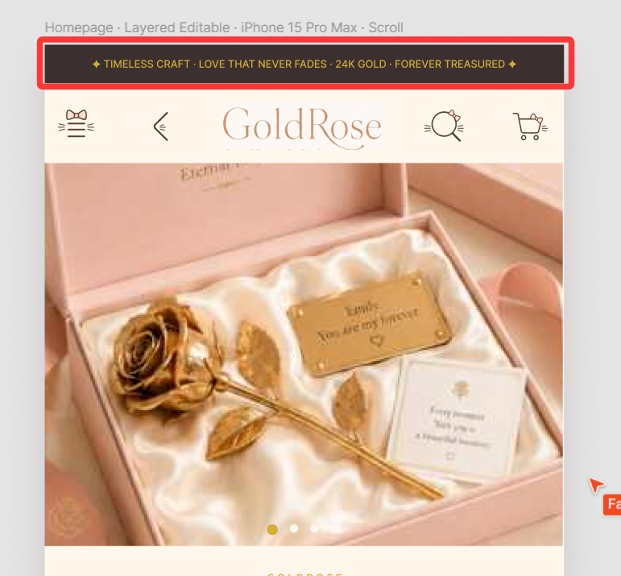

| Field | Content |
|---|---|
| Layout | Above the nav bar; pinned display at the very top |
| Clickable/operable | Not clickable |
| Trigger | None |
| Result | Display only, no navigation |
| Target page/surface | Current homepage |
| States & feedback | Stays visible with the page |
| Dev notes | Announcement copy configurable in the backend |
| Target-page status | No separate page needed |

## Top nav bar

### H-01 · Menu icon button

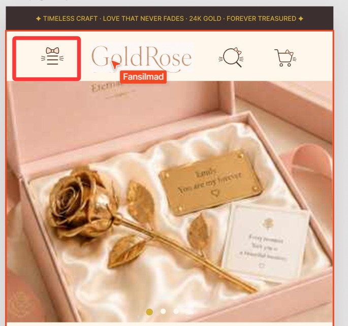

| Field | Content |
|---|---|
| Layout | Sticky at top; left-aligned |
| Clickable/operable | Clickable |
| Trigger | Single tap |
| Result | Opens the left navigation drawer; no page navigation |
| Target page/surface | Side navigation drawer |
| States & feedback | Shows overlay and locks page scroll while open; close via overlay tap or close button |
| Dev notes | — |
| Target-page status | Not done |

### H-05 · Logo link

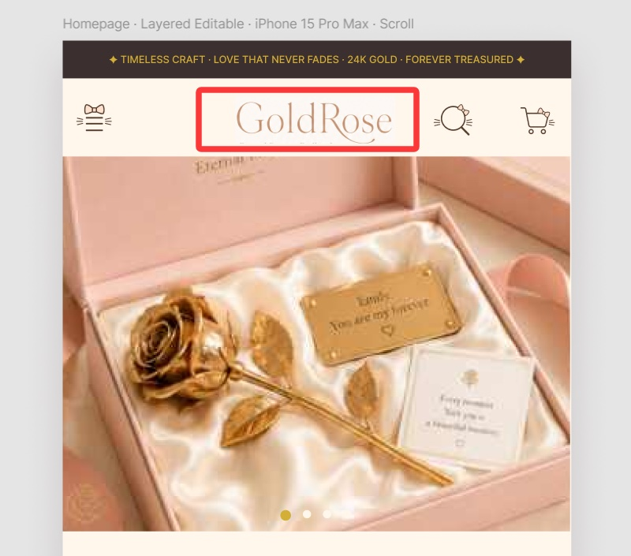

| Field | Content |
|---|---|
| Layout | Sticky at top; horizontally centered |
| Clickable/operable | Clickable |
| Trigger | Single tap |
| Result | On the homepage: smooth-scroll to top; on inner pages: navigate to the homepage |
| Target page/surface | Homepage top |
| States & feedback | Pressed/opacity feedback on tap; focus remains accessible after the scroll completes |
| Dev notes | Don't re-refresh when already on the homepage; inner pages return to the homepage via in-site routing. |
| Target-page status | — |

### H-06 · Search icon button

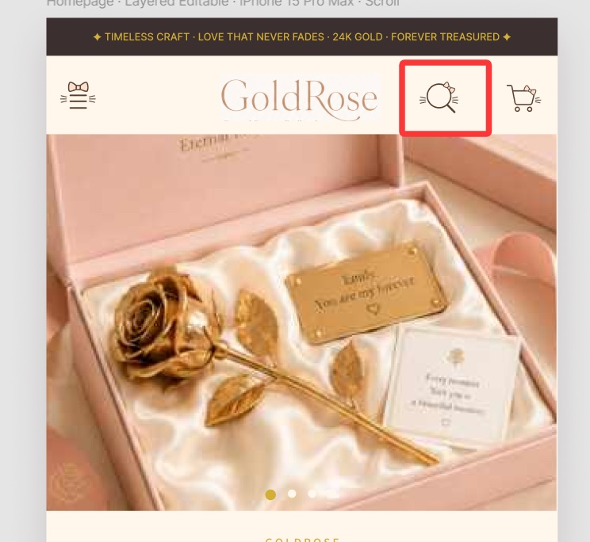

| Field | Content |
|---|---|
| Layout | Sticky at top; right of the logo |
| Clickable/operable | Clickable |
| Trigger | Tap; type a keyword then press Enter |
| Result | First expands the search box/search layer; on submit, navigates to the search results page |
| Target page/surface | Search layer / search results page |
| States & feedback | Auto-focuses the input on expand; supports clear, close, loading, no-results and error states |
| Dev notes | Empty keyword doesn't submit; URL-encode the query and refill it on the results page. Route is a suggestion, pending dev confirmation. |
| Target-page status | Not done |

### H-04 · Cart icon button

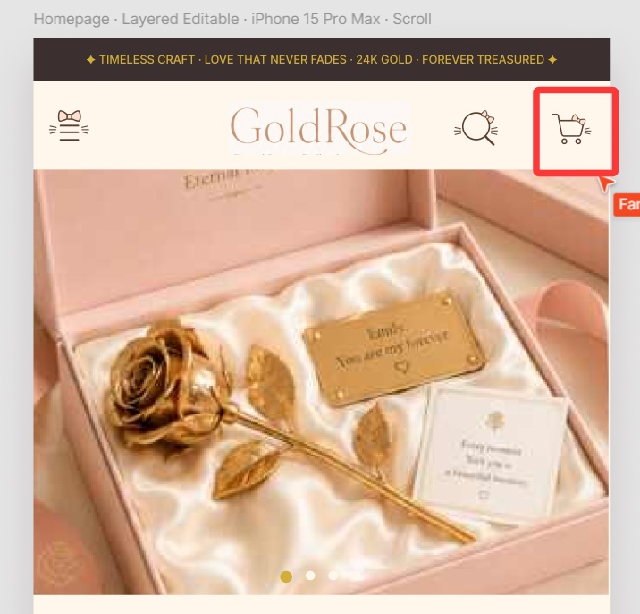

| Field | Content |
|---|---|
| Layout | Sticky at top; far right |
| Clickable/operable | Clickable |
| Trigger | Single tap |
| Result | Opens the cart side drawer; can proceed to the full cart page |
| Target page/surface | Cart side drawer; full-screen cart view |
| States & feedback | — |
| Dev notes | Overlay + scroll lock while the drawer is open; item count and cart data sync in real time. |
| Target-page status | — |

## Hero

### H-03 · Carousel + pagination dots

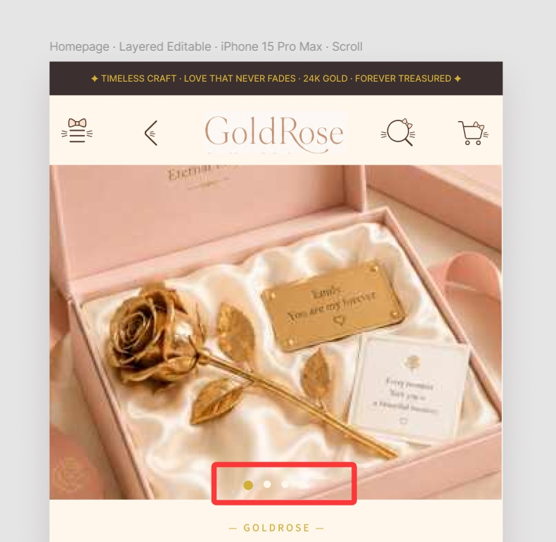

| Field | Content |
|---|---|
| Layout | Supports left/right swipe |
| Clickable/operable | Operable; clickable |
| Trigger | Swipe left/right; tap a pagination dot |
| Result | In-site route navigation |
| Target page/surface | The corresponding product detail page |
| States & feedback | Current dot highlighted; smooth transition on switch; consistent wrap-around at first/last |
| Dev notes | Dot count is generated from carousel data; placeholder image on load failure; auto-play pauses on hover or touch. |
| Target-page status | — |

### H-07 · Primary CTA button

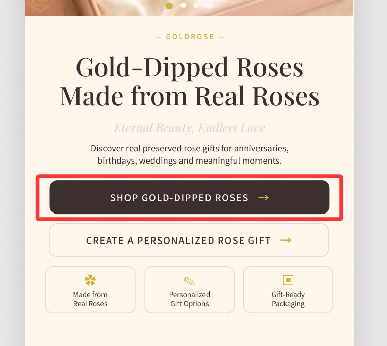

| Field | Content |
|---|---|
| Layout | Within the hero copy area; primary button |
| Clickable/operable | Clickable |
| Trigger | Single tap |
| Result | In-site navigation to the shop page |
| Target page/surface | Shop page |
| States & feedback | Hover, pressed, keyboard-focus states; loading feedback during navigation |
| Dev notes | Preserve filter params; restore page number and scroll position when returning from the shop page. |
| Target-page status | — |

### H-08 · Secondary CTA button

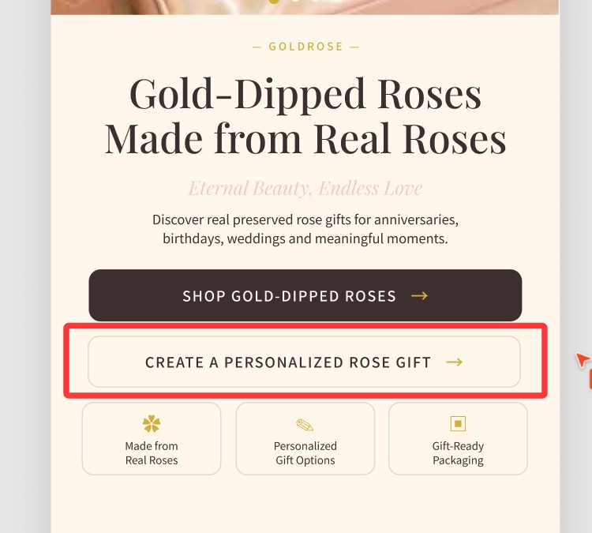

| Field | Content |
|---|---|
| Layout | Below the primary CTA; secondary outlined button |
| Clickable/operable | Clickable |
| Trigger | Single tap |
| Result | In-site navigation to the personalization page |
| Target page/surface | Personalization page |
| States & feedback | Hover, pressed, keyboard-focus states; when signed out, handle draft identity per product rules |
| Dev notes | The personalization flow must support draft save & restore. Route is a suggestion, pending dev confirmation. |
| Target-page status | Future iteration (not currently planned) |

## Best Sellers

### H-09 · Product-card carousel

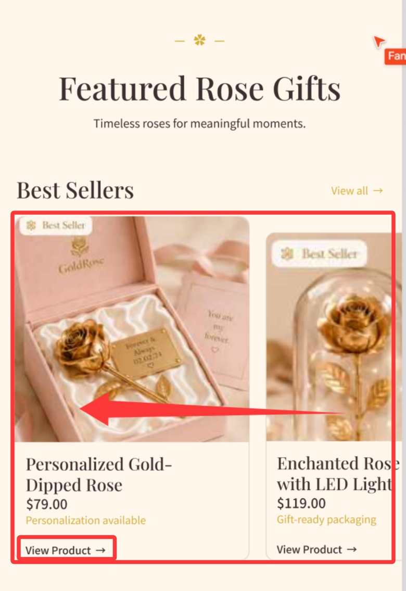

| Field | Content |
|---|---|
| Layout | Horizontally swipeable cards; current card moderately enlarged |
| Clickable/operable | Clickable, swipeable |
| Trigger | Swipe left/right; tap the card, product title, or View Product |
| Result | In-site navigation to the selected product's detail page |
| Target page/surface | Product detail page |
| States & feedback | Current card emphasized; supports loading, image-failure, sold-out and unavailable states |
| Dev notes | The same product ID/slug must open the same detail page from every entry point (all products, best sellers, filtered results, recommendation slots) — never create multiple detail pages per entry; restore carousel position on return. |
| Target-page status | — |

### H-10 · View all text link

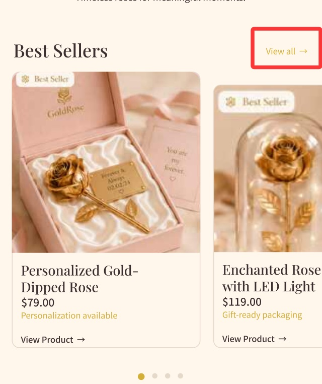

| Field | Content |
|---|---|
| Layout | Right of the module title |
| Clickable/operable | Clickable |
| Trigger | Single tap |
| Result | In-site navigation to the best-sellers collection page |
| Target page/surface | Best Sellers product list |
| States & feedback | Underline/color change on hover; loading feedback during navigation |
| Dev notes | Preserve filter params; restore the original page number and scroll position when returning from the best-sellers collection page. |
| Target-page status | — |

## New Arrivals

### H-11 · New-collection feature card

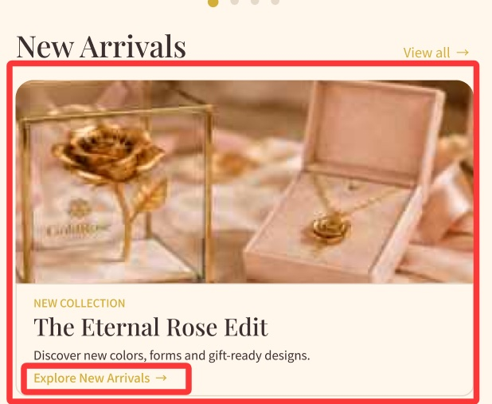

| Field | Content |
|---|---|
| Layout | First large card of the module; within the content flow |
| Clickable/operable | Clickable |
| Trigger | Tap the card or Explore New Arrivals |
| Result | In-site navigation to the product detail page |
| Target page/surface | The corresponding product detail page |
| States & feedback | Hover, pressed, keyboard-focus states; placeholder image on failure |
| Dev notes | Restore the original page number and scroll position when returning from the product detail page. |
| Target-page status | — |

### H-12 · Product-card carousel

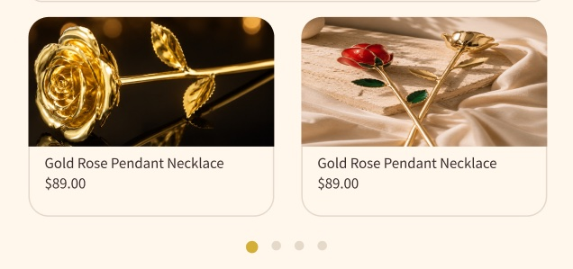

| Field | Content |
|---|---|
| Layout | Below the feature card; horizontal swipe; pagination dots centered |
| Clickable/operable | Clickable, swipeable |
| Trigger | Swipe left/right; tap a product card |
| Result | Swiping changes card position; tap navigates in-site to the product detail page |
| Target page/surface | Current homepage carousel / product detail page |
| States & feedback | Current dot highlighted; supports loading, image-failure, sold-out and no-more-cards states |
| Dev notes | The same product ID/slug opens the same detail page across all products, best sellers, filtered results and recommendation slots; restore carousel position on return. |
| Target-page status | — |

### H-13 · View all text link

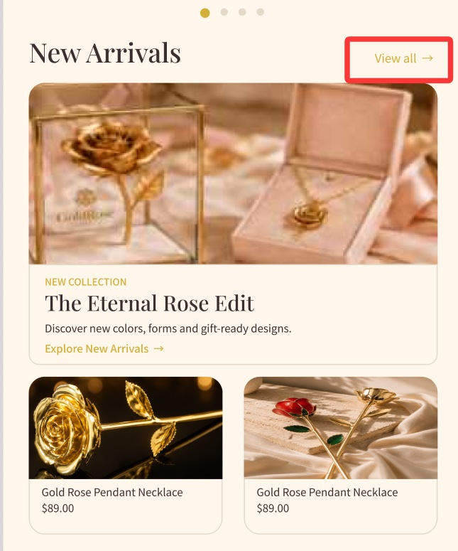

| Field | Content |
|---|---|
| Layout | Right of the module title |
| Clickable/operable | Clickable |
| Trigger | Single tap |
| Result | In-site navigation to the new-arrivals collection page |
| Target page/surface | New Arrivals product list |
| States & feedback | Underline/color change on hover; loading feedback during navigation |
| Dev notes | Preserve filter params; restore the original page number and scroll position on return. |
| Target-page status | — |

## Ready to Ship

### H-14 · Product-card carousel + View all

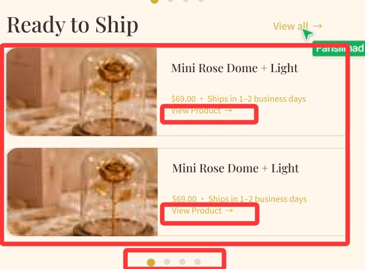

| Field | Content |
|---|---|
| Layout | Horizontally swipeable list; pagination dots centered |
| Clickable/operable | Clickable, swipeable |
| Trigger | Swipe left/right; tap a product card / View Product / View all |
| Result | Product card → detail page; View all → ready-to-ship collection page |
| Target page/surface | Product detail page / Ready to Ship product list |
| States & feedback | Current dot highlighted; supports loading, sold-out, no-more and navigation feedback |
| Dev notes | Same product ID/slug opens the same detail page across entry points; the collection page keeps filter and pagination params; restore page number and scroll position on return. |
| Target-page status | — |

## MORI guided-shopping entries

### H-15 · Find a Gift path card

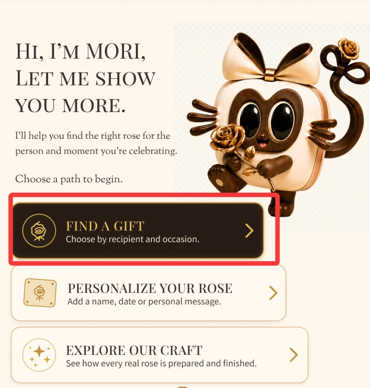

| Field | Content |
|---|---|
| Layout | First of the MORI module's three paths; visually emphasized |
| Clickable/operable | Clickable |
| Trigger | Single tap |
| Result | In-site navigation to the gift-recommendation questionnaire |
| Target page/surface | Gift Finder page |
| States & feedback | Hover, pressed, keyboard-focus states; retry offered on load failure |
| Dev notes | After entry, collect preferences by recipient and occasion |
| Target-page status | To be confirmed |

### H-16 · Personalize Your Rose path card

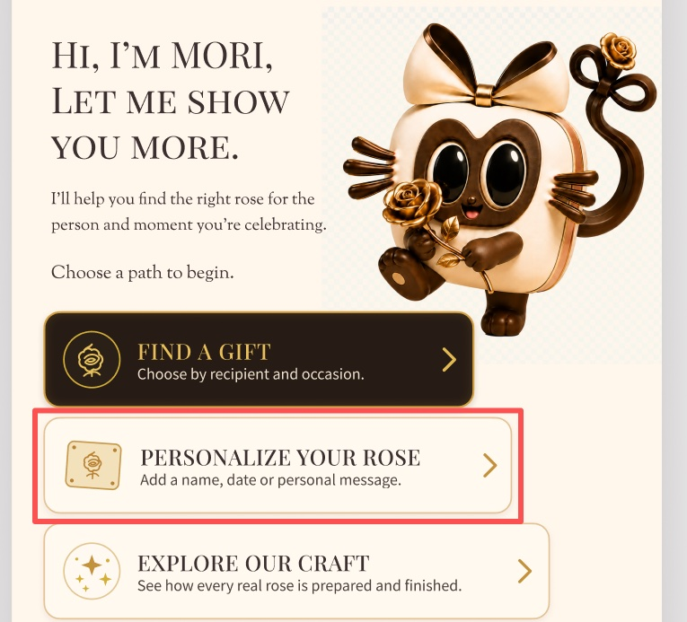

| Field | Content |
|---|---|
| Layout | Second of the MORI module's three paths |
| Clickable/operable | Clickable |
| Trigger | Single tap |
| Result | In-site navigation to the personalization flow |
| Target page/surface | Personalization page |
| States & feedback | Hover, pressed, keyboard-focus states; keep any existing personalization draft |
| Dev notes | Personalization data is saved per user / guest session. |
| Target-page status | Future iteration (not currently planned) |

### H-17 · Explore Our Craft path card

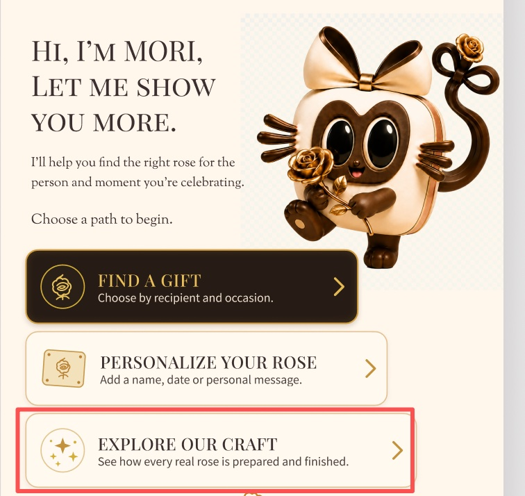

| Field | Content |
|---|---|
| Layout | Third of the MORI module's three paths |
| Clickable/operable | Clickable |
| Trigger | Single tap |
| Result | In-site navigation to the brand craft page |
| Target page/surface | Brand story & craft page |
| States & feedback | Hover, pressed, keyboard-focus states; loading feedback during navigation |
| Dev notes | Target page opens at the craft content's first screen by default. Route is a suggestion, pending dev confirmation. |
| Target-page status | Not done |

## Shop by Occasion

### H-18 · Occasion filter tabs/chips

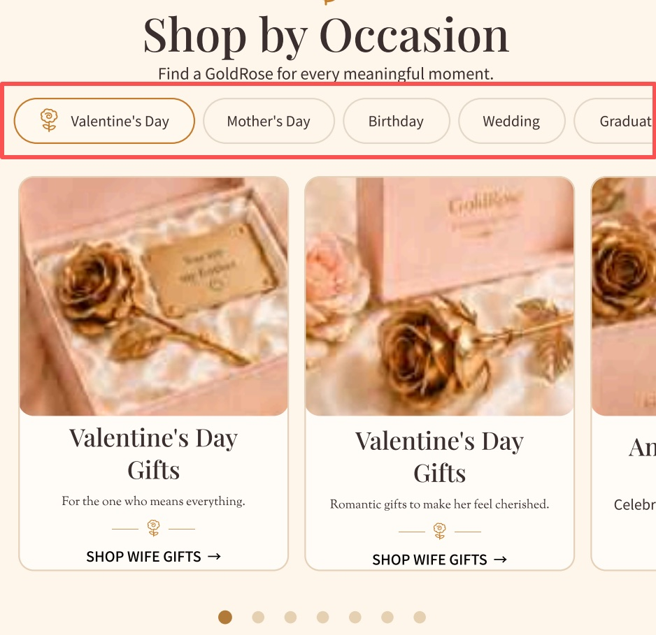

| Field | Content |
|---|---|
| Layout | Horizontal row below the module title; scrolls horizontally on overflow |
| Clickable/operable | Clickable, swipeable |
| Trigger | Tap an option; swipe the option row |
| Result | Switches the occasion-card data below in place; no page navigation |
| Target page/surface | Homepage Shop by Occasion module |
| States & feedback | Selected chip highlighted; skeleton screen while switching; empty state when no results |
| Dev notes | Single-select |
| Target-page status | No separate page needed |

### H-19 · Occasion category-card carousel

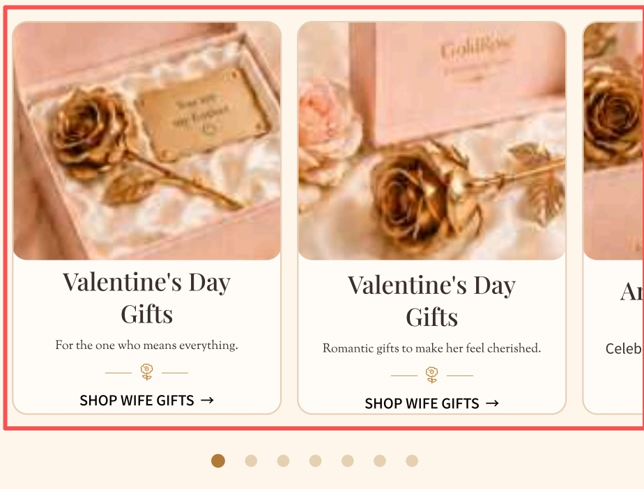

| Field | Content |
|---|---|
| Layout | Horizontally swipeable cards; pagination dots centered |
| Clickable/operable | Clickable, swipeable |
| Trigger | Swipe left/right; tap a card or "Shop … Gifts" |
| Result | In-site navigation to the product list pre-filtered by that occasion |
| Target page/surface | Occasion collection page |
| States & feedback | Current dot highlighted; supports loading, no-results and no-more states |
| Dev notes | The list keeps occasion filter, page and sort params; restore the original page number and scroll position when returning from detail. |
| Target-page status | — |

## Blog entry

### H-20 · Blog card

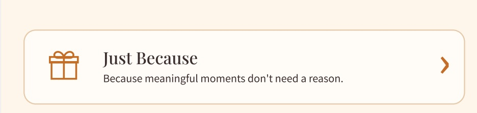

| Field | Content |
|---|---|
| Layout | Full-width in the content flow; icon, title, blurb and arrow in a horizontal row |
| Clickable/operable | Clickable |
| Trigger | Tap anywhere on the card |
| Result | In-site navigation to the blog page |
| Target page/surface | The corresponding blog detail page |
| States & feedback | Card highlights on hover/press, right arrow nudges right; loading state during navigation |
| Dev notes | The whole card is the hit area, not only the arrow |
| Target-page status | Not done |

> ⚠️ Dev note: the original target-page text "相对应的客详情页" should read "相对应的博客详情页" (blog detail page) — a typo.

## Shop by Recipient

### H-21 · Recipient filter tabs/chips

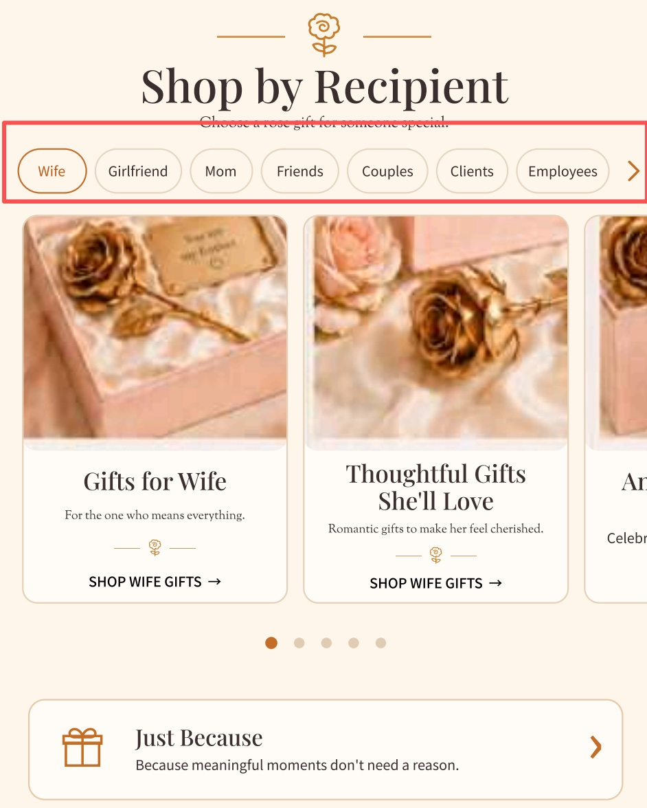

| Field | Content |
|---|---|
| Layout | Horizontal row below the module title; scrolls horizontally on overflow |
| Clickable/operable | Clickable, swipeable |
| Trigger | Tap an option; swipe the option row |
| Result | Switches the recipient-card data below in place; no page navigation |
| Target page/surface | Homepage Shop by Recipient module |
| States & feedback | Selected chip highlighted; skeleton screen while switching; empty state when no results |
| Dev notes | Single-select |
| Target-page status | No separate page needed |

### H-22 · Recipient category-card carousel

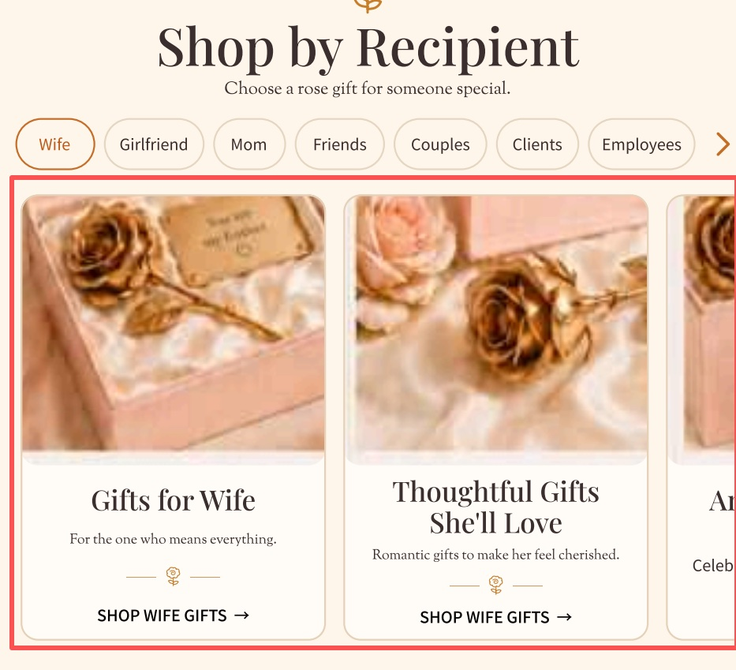

| Field | Content |
|---|---|
| Layout | Horizontally swipeable cards; pagination dots centered |
| Clickable/operable | Clickable, swipeable |
| Trigger | Swipe left/right; tap a card or "Shop … Gifts" |
| Result | In-site navigation to the product list pre-filtered by that recipient |
| Target page/surface | Recipient collection page |
| States & feedback | Current dot highlighted; supports loading, no-results and no-more states |
| Dev notes | The list keeps recipient filter, page and sort params; restore the original page number and scroll position when returning from detail |
| Target-page status | To be confirmed |

## Blog entry

### H-23 · Blog card

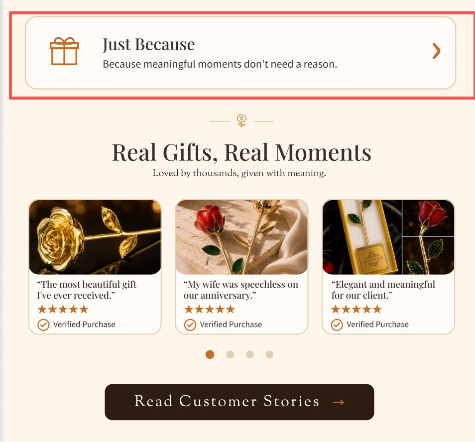

| Field | Content |
|---|---|
| Layout | Below the recipient card list; full-row card |
| Clickable/operable | Clickable |
| Trigger | Tap anywhere on the card |
| Result | In-site navigation to the blog page |
| Target page/surface | The corresponding blog detail page |
| States & feedback | Card highlights on hover/press, right arrow nudges right; loading state during navigation |
| Dev notes | The whole card is the hit area, not only the arrow |
| Target-page status | Not done |

> ⚠️ Dev note: the original target-page text "相对应的客详情页" should read "相对应的博客详情页" (blog detail page) — a typo.

## Customer stories

### H-24 · Read Customer Stories CTA

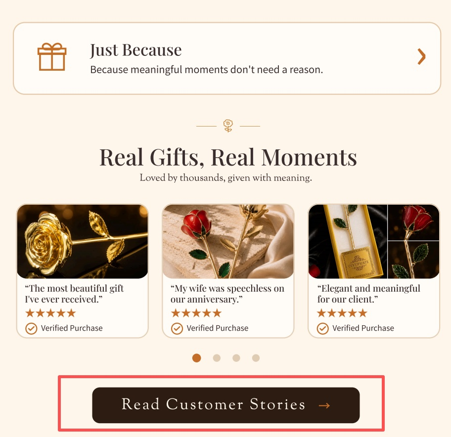

| Field | Content |
|---|---|
| Layout | Below the customer-review carousel; centered primary button |
| Clickable/operable | Clickable |
| Trigger | Single tap |
| Result | In-site navigation to the customer stories list page |
| Target page/surface | Customer stories / BLOG list |
| States & feedback | Hover, pressed, keyboard-focus states; loading feedback during navigation |
| Dev notes | Customer story cards open detail by article slug |
| Target-page status | Not done |

## MORI gift recommender

### H-25 · Criteria option chips

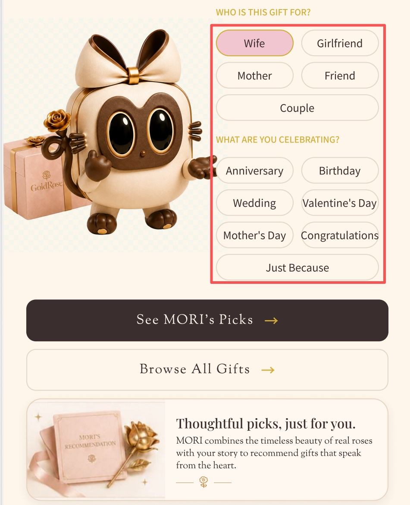

| Field | Content |
|---|---|
| Layout | Grouped by "recipient" and "occasion"; wraps horizontally within each group |
| Clickable/operable | Selectable |
| Trigger | Tap a chip |
| Result | Updates the selected criteria in place; no page navigation |
| Target page/surface | Homepage MORI recommendation module |
| States & feedback | Selected chip highlighted; tapping again deselects per product rules; CTA not submittable until required selections are complete |
| Dev notes | Per the screenshot, single-select within each group; on submit pass standard recipient and occasion slugs, not the display copy. |
| Target-page status | No separate page needed |

### H-26 · See MORI's Picks primary CTA

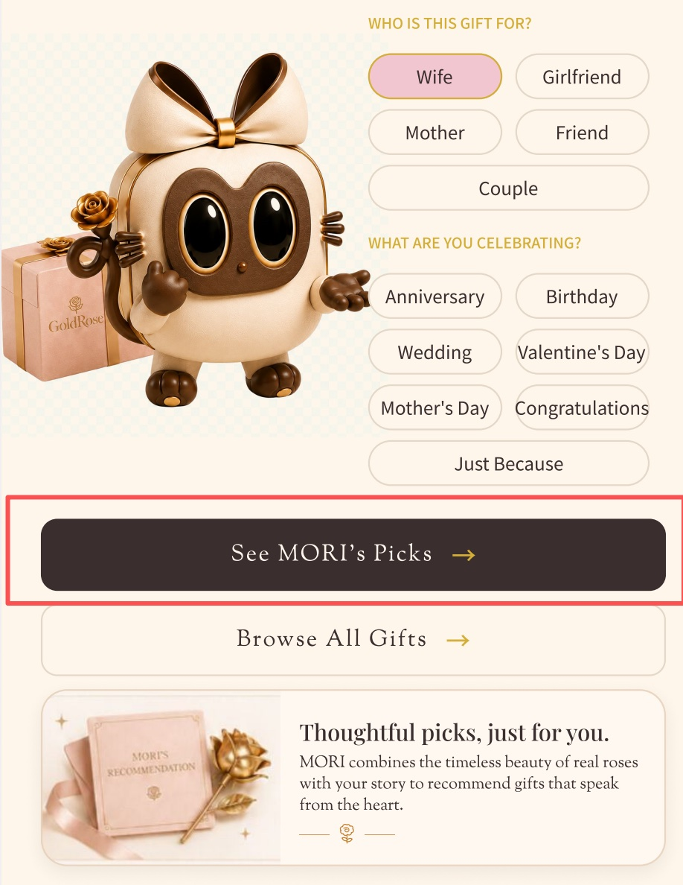

| Field | Content |
|---|---|
| Layout | Below the option groups; full-width primary button |
| Clickable/operable | Clickable |
| Trigger | Tap to submit |
| Result | Submits the selected criteria and opens the recommendation results modal/drawer |
| Target page/surface | MORI recommendation results modal |
| States & feedback | Button disabled with missing-item hint when criteria incomplete; loading while submitting; retry on failure; Browse All Gifts offered when no results |
| Dev notes | Recommendation cards use real product IDs/slugs; the same product routes to /products/:slug across recommendation slots and lists — no duplicate detail pages. |
| Target-page status | Not done |

### H-27 · Browse All Gifts secondary CTA

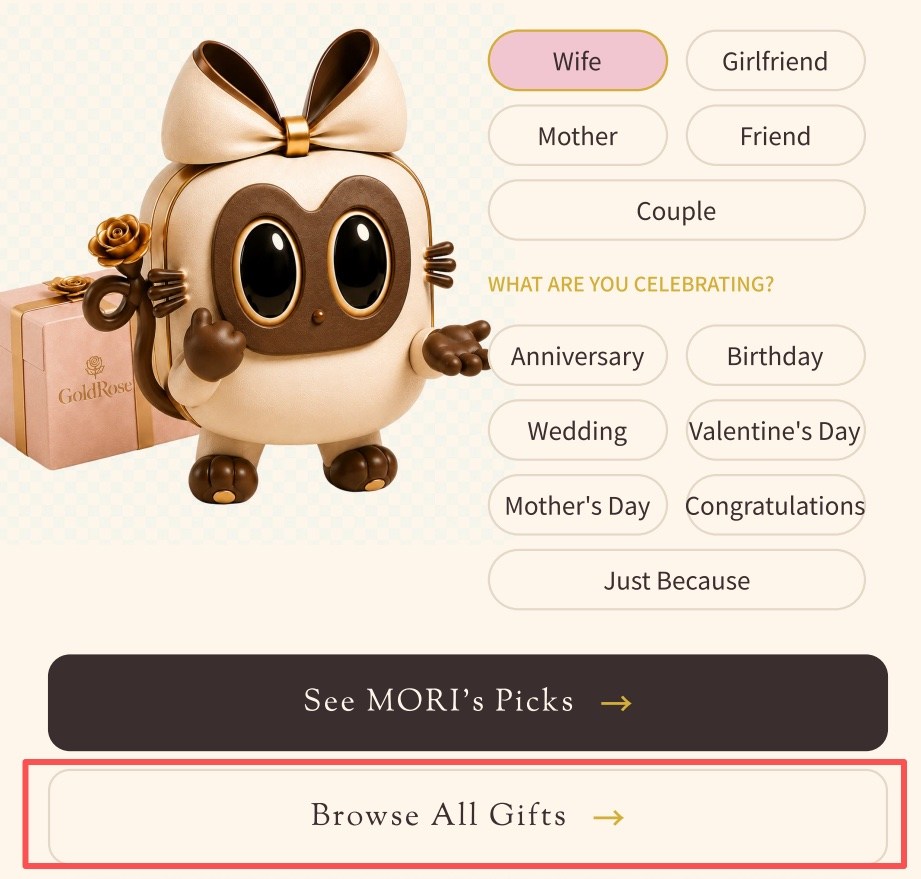

| Field | Content |
|---|---|
| Layout | Below the primary CTA; full-width secondary button |
| Clickable/operable | Clickable |
| Trigger | Single tap |
| Result | In-site navigation to the all-gifts product list |
| Target page/surface | All products / gifts collection page |
| States & feedback | Hover, pressed, keyboard-focus states; loading feedback during navigation |
| Dev notes | Preserve filter params; restore the original page number and scroll position when returning from detail. |
| Target-page status | — |

## Personalization four-step

### H-28 · Step entry list

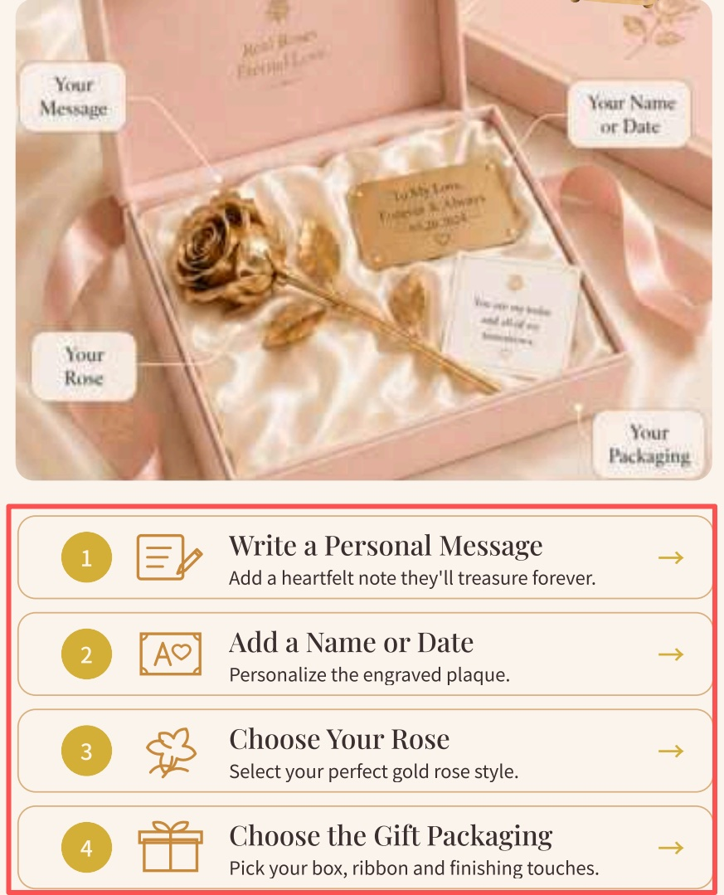

| Field | Content |
|---|---|
| Layout | Below the product preview; four rows stacked vertically |
| Clickable/operable | Clickable |
| Trigger | Tap any step row or its right arrow |
| Result | Opens that step's modal/drawer and edits the item on the current page |
| Target page/surface | Personalization step overlays (message, plaque, rose, packaging) |
| States & feedback | Completed steps show a summary/done state; incomplete steps show the default hint; selections are kept after closing the overlay |
| Dev notes | The four steps share one draft ID; switching steps must not lose data. Route is a suggestion, pending dev confirmation. |
| Target-page status | Future iteration (not currently planned) |

### H-29 · Continue Personalizing primary CTA

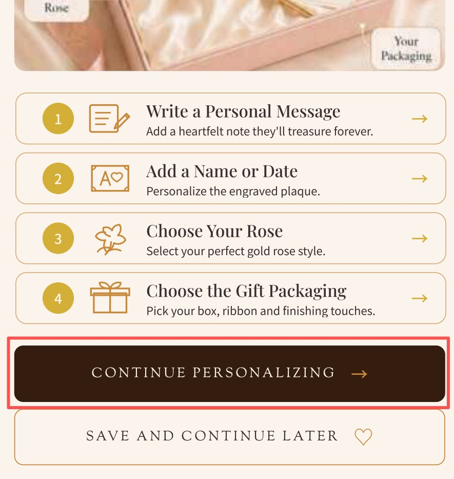

| Field | Content |
|---|---|
| Layout | Below the step list; full-width primary button |
| Clickable/operable | Clickable |
| Trigger | Single tap |
| Result | Saves the current draft and navigates in-site to the full personalization page to continue editing/purchase |
| Target page/surface | Personalization page |
| States & feedback | Loading while saving; navigate on success; on failure keep current data and prompt retry |
| Dev notes | Pass the filled-in data via draft ID — never rely on frontend memory alone; the target page reads the same draft. Route is a suggestion, pending dev confirmation. |
| Target-page status | Future iteration (not currently planned) |

### H-30 · Save and Continue Later secondary CTA

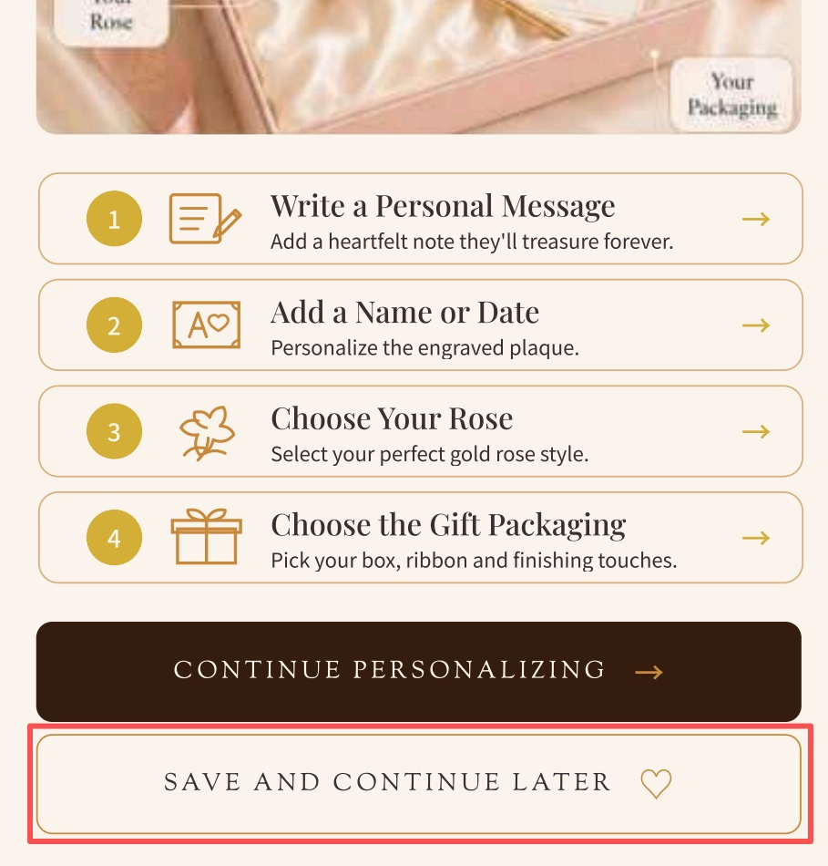

| Field | Content |
|---|---|
| Layout | Below the primary CTA; full-width secondary button |
| Clickable/operable | Clickable |
| Trigger | Tap to submit |
| Result | Saves the current personalization draft and shows a success prompt; no page navigation |
| Target page/surface | Save-success modal/toast |
| States & feedback | Prevent duplicate submits while saving; success prompt allows continued editing; on failure keep data and offer retry |
| Dev notes | Signed-in users bind the draft to their account; guests get a recoverable token with an explicit validity period and a recovery entry point. |
| Target-page status | Future iteration (not currently planned) |

## Craft intro

### H-31 · Explore Our Craft CTA

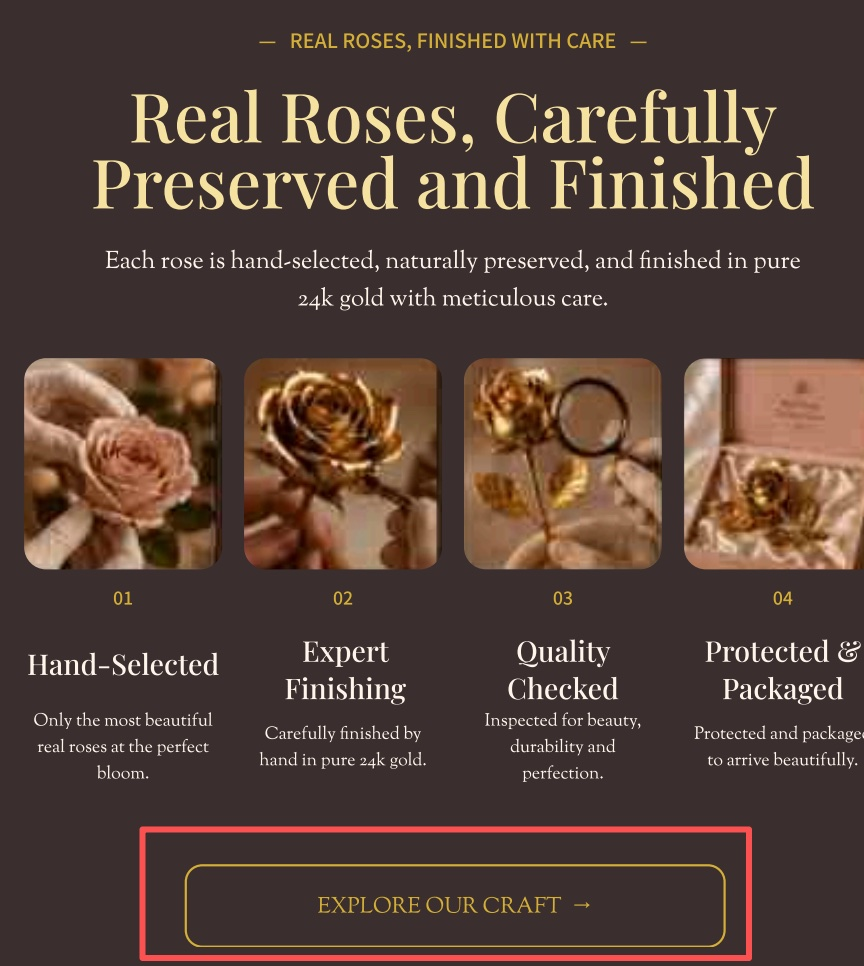

| Field | Content |
|---|---|
| Layout | Below the four-step craft explainer; centered button |
| Clickable/operable | Clickable |
| Trigger | Single tap |
| Result | In-site navigation to the brand craft page |
| Target page/surface | Craft section of the brand story & craft page |
| States & feedback | Hover, pressed, keyboard-focus states; loading feedback during navigation |
| Dev notes | Target page opens at the craft-process first screen by default. |
| Target-page status | Not done |

## GoldRose Workshop

### H-32 · See How We Work CTA

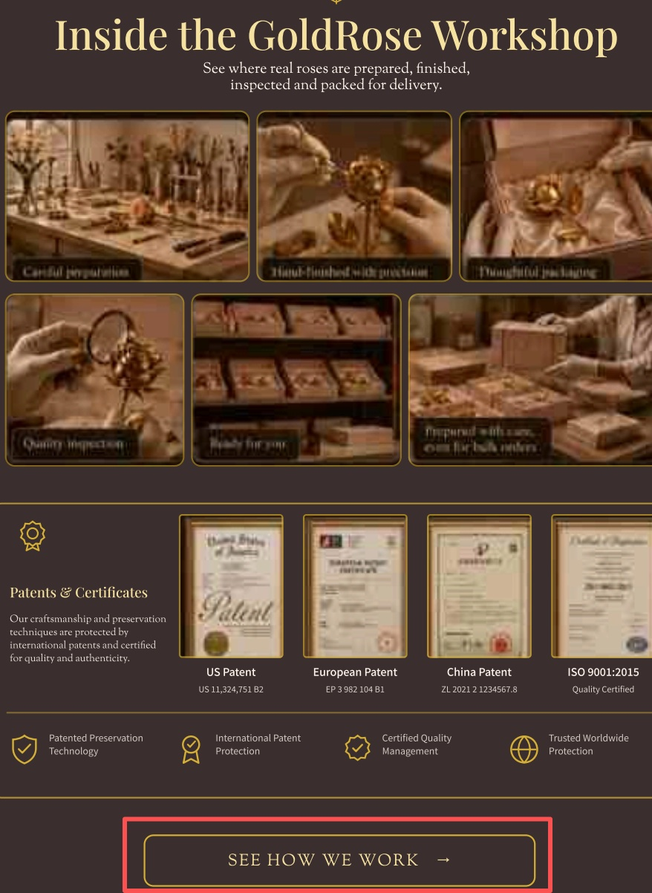

| Field | Content |
|---|---|
| Layout | Bottom of the workshop, craft & patent-certificate showcase module |
| Clickable/operable | Clickable |
| Trigger | Single tap |
| Result | In-site navigation to the workshop & patented-craft details |
| Target page/surface | Workshop/patent section of the brand story & craft page |
| States & feedback | Hover, pressed, keyboard-focus states; the heading receives focus after anchor scrolling completes |
| Dev notes | Patent certificate images are display content, not individually clickable by default; if zoom is offered, use an image lightbox. Route is a suggestion, pending dev confirmation. |
| Target-page status | Not done |

## Corporate partnership

### H-33 · Dual-CTA button group

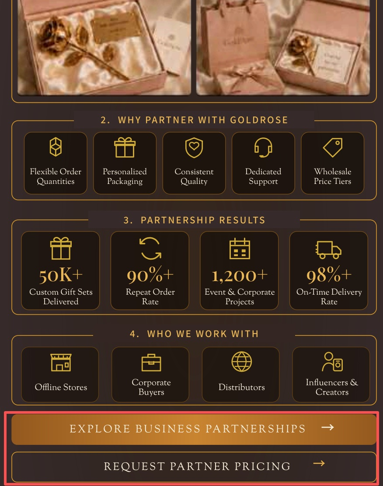

| Field | Content |
|---|---|
| Layout | Bottom of the partnership-capabilities module; stacked vertically |
| Clickable/operable | Clickable |
| Trigger | Tap the respective button |
| Result | Explore → partnership intro page; Request Partner Pricing → partner-pricing inquiry form |
| Target page/surface | Corporate partnership page / partner inquiry page |
| States & feedback | Hover, pressed, keyboard-focus states; form submission shows submitting, success and failure feedback |
| Dev notes | — |
| Target-page status | — |

## Brand story

### H-34 · Read Our Story CTA

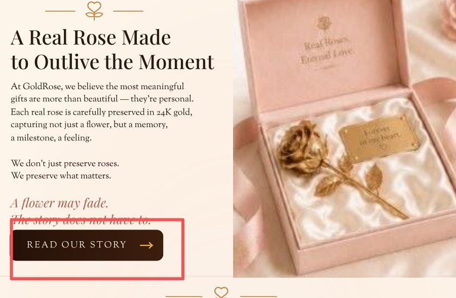

| Field | Content |
|---|---|
| Layout | Lower left of the split image/text module |
| Clickable/operable | Clickable |
| Trigger | Single tap |
| Result | In-site navigation to the brand story page |
| Target page/surface | Brand story page |
| States & feedback | Hover, pressed, keyboard-focus states; loading feedback during navigation |
| Dev notes | Target page can reuse the brand story & craft page framework. |
| Target-page status | Not done |

## FAQ (homepage FAQ/blog knowledge area)

### H-35 · Blog article entry list

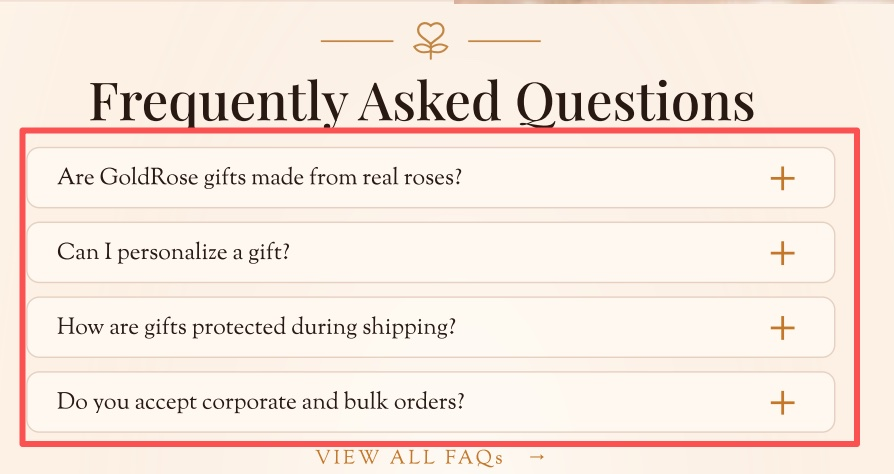

| Field | Content |
|---|---|
| Layout | Four items stacked vertically; titles left, entry icon right |
| Clickable/operable | Clickable |
| Trigger | Single tap (cell was lost to a column shift in the original; inferred from context) |
| Result | Navigates to the blog article matching the chosen question |
| Target page/surface | That question's blog article page |
| States & feedback | Whole row highlights on hover/press; loading state during navigation |
| Dev notes | The four questions share one component but each binds its own article ID/slug; the whole row is clickable. The current "＋" icon is easily read as expand-answer — if it actually navigates, suggest changing it to a right chevron "›" |
| Target-page status | Not done |

> ⚠️ Dev note: this row was column-shifted in the original sheet (an extra cell after Module, Trigger missing) and has been realigned by column meaning; apart from the inferred "single tap", no wording was changed.

## Footer CTA

### H-36 · Shop All GoldRose Gifts primary CTA

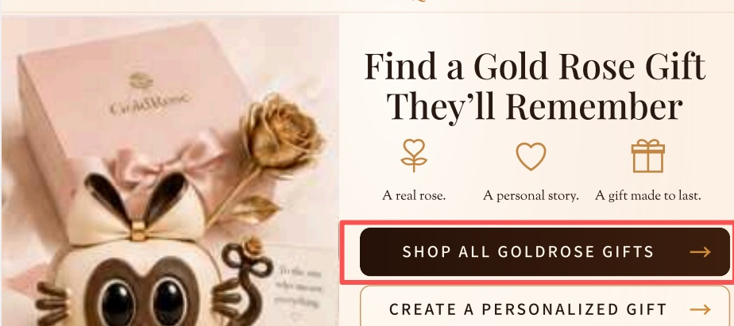

| Field | Content |
|---|---|
| Layout | Within the footer brand banner; primary button |
| Clickable/operable | Clickable |
| Trigger | Single tap |
| Result | In-site navigation to the all-products collection page |
| Target page/surface | All products list |
| States & feedback | Hover, pressed, keyboard-focus states; loading feedback during navigation |
| Dev notes | Preserve filter params; restore the original page number and scroll position when returning from detail. |
| Target-page status | To be confirmed |

### H-37 · Create a Personalized Gift secondary CTA

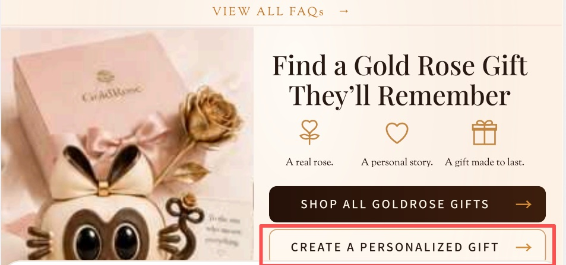

| Field | Content |
|---|---|
| Layout | Below the footer primary CTA; secondary outlined button |
| Clickable/operable | Clickable |
| Trigger | Single tap |
| Result | In-site navigation to the personalization flow |
| Target page/surface | Personalization page |
| States & feedback | Hover, pressed, keyboard-focus states; keep any existing personalization draft |
| Dev notes | Reuses the same route and draft-restore logic as the hero personalization entry. Route is a suggestion, pending dev confirmation. |
| Target-page status | Future iteration (not currently planned) |
